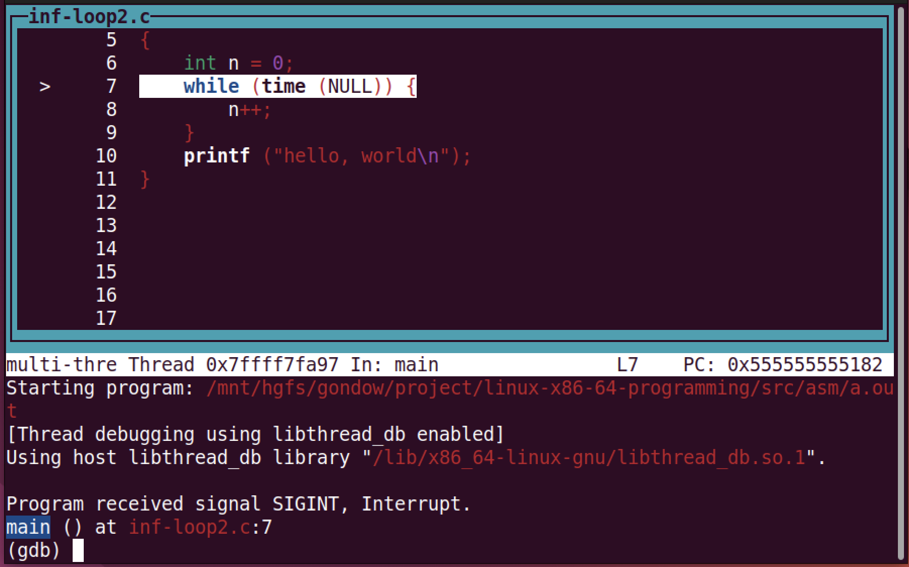
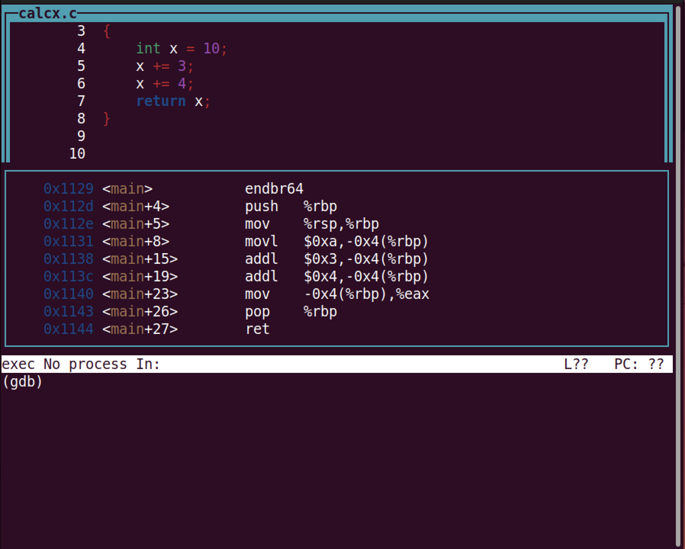
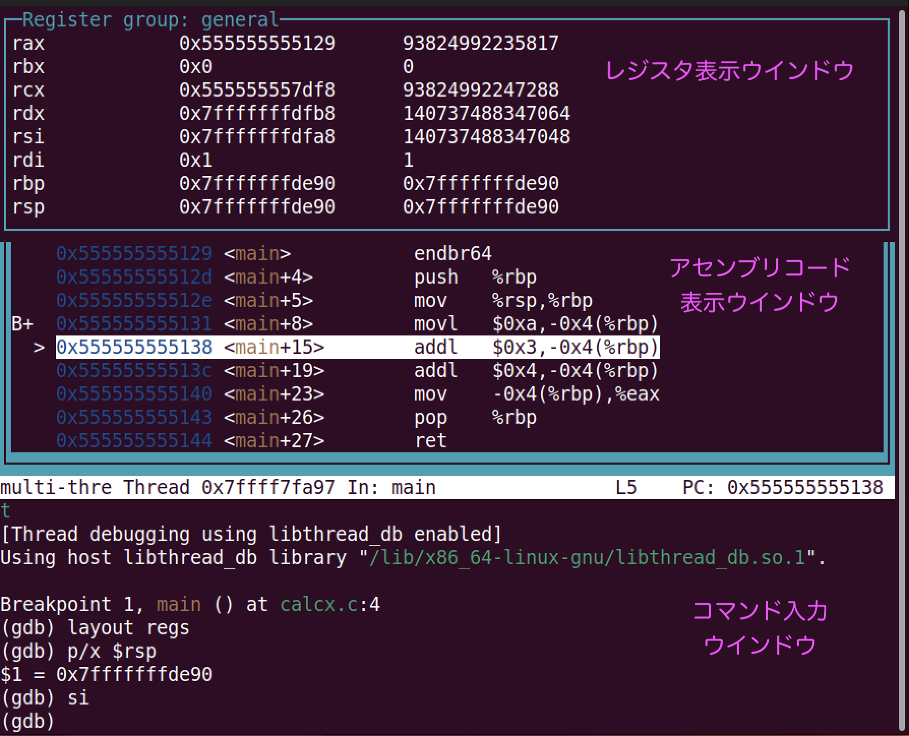

<style type="text/css">
body { counter-reset: chapter 10; }
</style>

# デバッガ`gdb`の使い方

## デバッガの概要
### なぜデバッガ?


- `gdb`などのデバッガの使用をお薦めする理由は「プログラムのデバッグ」を**とても楽にしてくれる**からです！！
- デバッグが難しいのは実行中のプログラムの中身（実行状態）が外からでは見えにくいからです．
  `printf`を埋め込むことでも変数の値や実行パスを調べられますが，
  デバッガを使うともっと効率的に調べることができます．
- デバッガは「簡単に習得できて，効果も高いお得な開発ツール」です．
  慣れることが大事です．
- デバッガはつまみ食いOKです．
  最初は「自分が使いたい機能，使える機能」だけを使えばいいのです．
  デバッガを使うために「デバッガの全て」を学ぶ必要はありません．

### デバッガとは


デバッガは主に以下の機能を組み合わせて，プログラムの実行状態を調べることで，
バグの原因を探します．

- ① プログラム実行の一時停止:
     「実行を止めたい場所(**ブレークポイント**)」や止めたい条件を設定できます．
     ブレークポイントには関数名や行番号やアドレスなどを指定できます．
- ② **ステップ実行**:
     ①でプログラムの実行を一時停止した後，
     ステップ実行の機能を使って，ちょっとずつ実行を進めます．
- ③ 実行状態の表示:
     変数の値，現在の行番号，スタックトレース(バックトレース)などを表示できます．
- ④ 実行状態の変更:
     変数に別の値を代入したり，関数を呼び出したりして，
     「ここでこう実行したら」を試せます．

### `gdb`とは

- **Linux**上で使える代表的で高性能なデバッガです．
- C/C++/**アセンブリ言語**/Objective-C/Rustなど，多くの言語をサポートしています．
- **Linux/x86-64**を含む，多くのOSやプロセッサに対応しています．
- オープンソースで無料で使えます (GNU GPLライセンス)．
- 一次情報: [GDB: The GNU Project Debugger](https://www.sourceware.org/gdb/)

## `gdb`の実行例 (C言語編)

### 起動 `run` と終了 `quit`

```
{{#include asm/hello.c}}
```

```
$ gcc ❶ -g hello.c
$ ./a.out
hello
$ ❷ gdb ./a.out
❸(gdb) ❹ run
hello
(gdb) ❺ quit
A debugging session is active.
	Inferior 1 [process 20186] will be killed.
Quit anyway? (y or n)  ❻ y
$
```

- `gdb`でデバッグする前に，`gcc`のコンパイルに❶`-g`オプションを付けます．
  `-g`は`a.out`に[デバッグ情報](./3-binary.md#デバッグ情報)を付加します．
  デバッグ情報がなくてもデバッグは可能ですが，
  ファイル名や行番号などの情報が表示されなくなり不便です．

<details>
<summary>
gcc -g -Og オプションがベスト
</summary>

`gdb`のマニュアルに以下の記述があります．

- `-O2`などの最適化オプションを付けてコンパイルしたプログラムでも`gdb`で
   デバッグできるが，行番号がずれたりする．なので可能なら
   最適化オプションを付けない方が良い．
- `gdb`でデバッグするベストな最適化オプションは`-Og`であり，
  `-Og`は`-O0`よりも良い．

ですので，デバッグ時には `gcc -g -Og`オプションがベストなようです．
</details>

-  ❷ `gdb ./a.out` と，引数にデバッグ対象のバイナリ(ここでは`./a.out`)を指定して`gdb`を起動します．

<details>
<summary>
gdb起動メッセージの抑制
</summary>

デフォルトで`gdb`を起動すると以下のような長い起動メッセージが出ます．

```bash
$ gdb ./a.out 
GNU gdb (Ubuntu 12.1-0ubuntu1~22.04) 12.1
Copyright (C) 2022 Free Software Foundation, Inc.
License GPLv3+: GNU GPL version 3 or later <http://gnu.org/licenses/gpl.html>
This is free software: you are free to change and redistribute it.
~There is NO WARRANTY, to the extent permitted by law.
~Type "show copying" and "show warranty" for details.
~This GDB was configured as "x86_64-linux-gnu".
~Type "show configuration" for configuration details.
~For bug reporting instructions, please see:
~<https://www.gnu.org/software/gdb/bugs/>.
~Find the GDB manual and other documentation resources online at:
~    <http://www.gnu.org/software/gdb/documentation/>.
~
~For help, type "help".
~Type "apropos word" to search for commands related to "word"...
~Reading symbols from ./a.out...
~(gdb) 
```

これを抑制するには，`gdb -q`オプションを付けるか，
`~/.gdbearlyinit`ファイルに以下を指定します．

```
set startup-quietly on
```
</details>

- ❸ `(gdb)` は｀gdb`のプロンプトです．`gdb`のコマンドが入力可能なことを示します．
- ❹ `run`は`gdb`上で**プログラムの実行を開始**します．
  ここではブレークポイントを指定していないため，そのまま`hello`を出力して
  プログラムは終了しました．
- ❺ `quit`は`gdb`を終了させます．
  (ここではすでにデバッグ対象のプログラムの実行は終了していますが)
  デバッグ対象のプログラムが終了しておらず，
  「本当に終了して良いか?」と聞かれたら，❻ `y`と答えて終了させます．

<details>
<summary>
コマンドの省略名
</summary>

`gdb`のコマンドは(区別できる範囲で)短く省略できます．
例えば，`run`は`r`，`quit`は`q`，それぞれ1文字でコマンドを指定できます．
慣れてきたらコマンドの省略名を使いましょう．
</details>

### コマンドライン引数`argv`を指定して実行

```
{{#include asm/argv.c}}
```

```
$ gcc -g argv.c
$ gdb ./a.out
Reading symbols from ./a.out...
(gdb) ❶ run a b c d
argv[0]=/mnt/hgfs/gondow/project/linux-x86-64-programming/src/asm/a.out
argv[1]=a
argv[2]=b
argv[3]=c
argv[4]=d
[Inferior 1 (process 20303) exited normally]
(gdb) 
```

- コマンドライン引数を与えてデバッグしたい場合は，
  `run`コマンドに続けて引数を与えます(ここでは`a b c d`)．

### 標準入出力を切り替えて実行

```
{{#include asm/cat.c}}
```

```
$ gcc -g cat.c
$ cat foo.txt
hello
byebye
$ gdb ./a.out
(gdb) run ❶ < foo.txt ❷ > out.txt
(gdb) quit
$ cat out.txt
hello
byebye
```

- 標準入出力をリダイレクトして(切り替えて)実行したい場合は，
  通常のシェルのときと同様に`run`コマンドの後で，
  ❶ `<` や❷ `>`を使って行います．

### segmentation fault (あるいは bus error)の原因を探る

```
{{#include asm/segv.c}}
```

```
$ gcc -g segv.c
$ ./a.out
❶ Segmentation fault (core dumped)
$ gdb ./a.out
(gdb) r
Program received signal SIGSEGV, ❷ Segmentation fault.
0x0000555555555162 in ❸ main () at ❹ segv.c:6
6	 ❺ printf ("%d\n", *p); 
(gdb) ❻ print/x p
$1 = ❼ 0xdeadbeef
(gdb) ❽ print/x *p
❾ Cannot access memory at address 0xdeadbeef
(gdb) quit
```

- `segv.c`をコンパイルして実行すると❶ segmentation fault が起きました．
  segumentation fault や bus error は正しくないポインタを使用して
  メモリにアクセスすると発生します．
- `gdb`上で`a.out`を実行すると，`gdb`上でも ❷ segmentation fault が起きました．
  発生場所は ❹ ファイル`segv.c`の`6行目`，❸ `main`関数内と表示されています．
  また，6行目のソースコード ❺ `printf ("%d\n", *p);`も表示されています．
- 変数`p`が怪しいので，❻ `print/x p`コマンドで変数`p`の値を表示させます．
  `/x`は「16進数で表示」を指示するオプションです．
  怪しそうな`0xDEADBEEF`という値が表示されました．
  (`print`コマンドは`p`と省略可能です)．

<details>
<summary>
怪しいアドレスとは
</summary>

まず，8の倍数ではないアドレスは怪しいです(正しいアドレスのこともあります)．
特に奇数のアドレスは怪しいです(正しいこともありますが)．
[アラインメント制約](./9-abi.md#alignment)を守るため，
多くのデータが4の倍数や8の倍数のアドレスに配置されるからです．

また慣れてくると，例えば「`0x7ffde9a98000`はスタックのアドレスっぽい」と
感じるようになります．
「これ，どこのメモリだろう」と思ったら
[メモリマップ](./3-binary.md#メモリマップを見る)を見て調べるのが良いです．
</details>

- 念のため，`print`コマンドで`*p`を表示させると
  (❽ `print/x *p`)，
  この番地にはアクセスできないことが確認できました
  (❾ `Cannot access memory at address 0xdeadbeef`)．

### 変数の値を表示 (`print`)

```
{{#include asm/calcx.c}}
```

```
$ gcc -g calcx.c
$ gdb ./a.out
(gdb) ❶ b main
Breakpoint 1 at 0x1131: file calcx.c, line 3.
(gdb) ❷ r
❸ Breakpoint 1, main () at calcx.c:3
3	 ❹ int x = 10;
(gdb) ❺ s
❻ 4	    x += 3;
(gdb) ❼ p x
❽ $1 = 10
(gdb) s
5	    x += 4;
(gdb) p x
$2 = 13
(gdb) q
```

- 使った[短縮コマンド](./10-gdb.md#gdb-commands):
  `b`(`break`), `r`(`run`), `s`(`step`), `p`(`print`), `q`(`quit`)
- ❶ `b main`で，`main`関数にブレークポイントを設定し，
  ❷ `r`で実行を開始すると，❸`main関数で実行が一時停止しました．
  ❹ `int x = 10;`は次に実行する文です(まだ**実行していません**)．
- ❺ `s`で，1行だけ実行を進めます．
  4行目 (❻ `4  x += 3;`)を実行する手前で実行が止まります．
- ここで `❼ p x`として `x`の値を表示させます．
  `❽ $1 = 10`と表示され，`x`の値は`10`と分かりました．
  (`$1`は`gdb`中で使える変数ですが，ここでは使っていません)．

### 変数の値を自動表示 (`display`)

```
{{#include asm/calcx.c}}
```

```
$ gcc -g calcx.c
$ gdb ./a.out
(gdb) b main
Breakpoint 1 at 0x1131: file calcx.c, line 4.
(gdb) r
Breakpoint 1, main () at calcx.c:4
4	    int x = 10;
(gdb) ❶ disp x
❷ 1: x = 21845
(gdb) s
5	    x += 3;
❸ 1: x = 10
(gdb) s
6	    x += 4;
❹ 1: x = 13
(gdb) s
7	    return x;
❺ 1: x = 17
(gdb) q
```

- 使った[短縮コマンド](./10-gdb.md#gdb-commands):
  `b`(`break`), `r`(`run`), `s`(`step`), `disp`(`display`), `q`(`quit`)
- 「何度も`p x`と入力するのが面倒」という人は`display`を使って，
  変数の値を自動表示させましょう．`display`は実行が停止するたびに，
  指定された変数の値を表示します．
- ここでは❶ `disp x`として，変数`x`の値を自動表示させます．
  (❷ `1: x = 21845`と出てるのは，変数`x`が未初期化のため，ゴミの値が表示されてるからです)．
- `s`で1行ずつ実行を進めるたびに，
  変数`x`の値が，❸ `1: x = 10`→ ❹ `1: x = 13`→ ❺ `1: x = 17` と変化するのが分かります．

### 条件付きブレークポイントの設定とバックトレース表示 (`break if`, `backtrace`)

```
{{#include asm/fact.c}}
```

```
$ gcc -g fact.c
$ gdb ./a.out
(gdb) ❶ b fact if n==0
Breakpoint 1 at 0x1158: file fact.c, line 5.
(gdb) ❷ r
❸ Breakpoint 1, fact (n=0) at fact.c:5
5	    if (n <= 0)
(gdb) ❹ bt
#0  fact (n=0) at fact.c:5
#1  0x0000555555555172 in fact (n=1) at fact.c:8
#2  0x0000555555555172 in fact (n=2) at fact.c:8
#3  0x0000555555555172 in fact (n=3) at fact.c:8
#4  0x0000555555555172 in fact (n=4) at fact.c:8
#5  0x0000555555555172 in fact (n=5) at fact.c:8
❺#6  0x000055555555518a in main () at fact.c:13
(gdb) q
```

- 使った[短縮コマンド](./10-gdb.md#gdb-commands):
  `b`(`break`), `r`(`run`), `bt`(`backtrace`), `q`(`quit`)
- ❶ `b fact if n==0`で，引数`n`が`0`の時だけ`fact`の実行を停止する設定をして，
  ❷ `r`で実行を開始すると，意図通り ❸ `fact (n=0)`で実行停止できました．
- ここで，❹`bt`として**バックトレース**を表示させます．
  バックトレースとは「今，実行中の関数から遡って`main`関数に至るまでの
  関数呼び出し系列」のことです．
  ❺`main`関数から，`fact(n=5)`→`fact(n=4)`→(中略)
  →`fact(n=0)`と呼び出されたことが分かります．
- なお，`backtrace full`とすると，
  バックトレースに加えて，局所変数の値も表示されます．

> 注: Ubuntu 20.04 LTSなど，少し古いLinuxを使っている人は
>  バックトレース中の引数の値が間違った表示
> になることがあります(私はなりました)．
> これは[古い`gdb`が`endbr64`命令に非対応だったから](https://stackoverflow.com/questions/64697087/gdb-shows-incorrect-arguments-of-functions-for-stack-frames)です．
> Ubuntu 22.04 LTSなど最新のLinuxにすることをお勧めします (2023年8月現在)．

### 変数や式の変更監視 (`watch`)

```
{{#include asm/calcx.c}}
```

```
$ gcc -g calcx.c
$ gdb ./a.out
(gdb) b main
Breakpoint 1 at 0x1131: file calcx.c, line 4.
(gdb) r
Breakpoint 1, main () at calcx.c:4
4	    int x = 10;
(gdb) ❶ wa x
Hardware watchpoint 2: x
(gdb) ❷ c
Continuing.

Hardware watchpoint 2: x
❸ Old value = 21845
❹ New value = 10
main () at calcx.c:5
5	    x += 3;
(gdb) c
Continuing.

Hardware watchpoint 2: x
Old value = 10
New value = 13
main () at calcx.c:6
6	    x += 4;
(gdb) c
Continuing.

Hardware watchpoint 2: x
Old value = 13
New value = 17
main () at calcx.c:7
7	    return x;
(gdb) q
```

- 使った[短縮コマンド](./10-gdb.md#gdb-commands):
  `b`(`break`), `r`(`run`), `wa`(`watch`), `c`(`continue`), `q`(`quit`)
- `watch`は指定した変数や式の変化(書き込み)を監視します．
 「どこで値が変わるのかわからない」という場合に便利です．
  ここでは ❶ `wa x`として変数`x`を監視する設定を行い，
  実行を再開します (❷ `c`)．
  変更箇所で自動的にブレークされて，
  変更前後の値が表示されました(❸ `Old value = 21845`，❹ `New value = 10`)．

- `break`と同様に，`watch`にも`if`で条件を指定できます．
  例えば，`wa x if x==13`とすると，変数の値が`13`になった時点でブレークできます．
  
- `watch`はハードウェア機能を使うため，
  高速ですが指定できる個数に限りがあります．
- `watch`には`-l`というオプションを指定可能です．
  このオプションを指定すると，指定した変数や式を評価して，
  その結果のアドレスへの書き込みを(変数のスコープを無視して)監視します．
  評価結果がアドレスでなかった場合(つまり左辺値を持たない式だった場合)は`gdb`はエラーを表示します．
	
- `watch`は「書き込み」を監視します．
  「読み込み」を監視したい時は`rwatch`，
  「読み書き」の両方を監視したい時は`awatch`を使って下さい．

### 実行中断と，実行途中での変数の値の変更{#set-var-x}

```
{{#include asm/inf-loop.c}}
```

```
$ gcc -g inf-loop.c
$ gdb ./a.out
(gdb) r

❶ ^C
❷ Program received signal SIGINT, Interrupt.
main () at inf-loop.c:7
7	    while (x != 0) {
(gdb) ❸ p x=0
$1 = 0
(gdb) ❹ c
Continuing.
❺ hello, world
(gdb) q
```

- 使った[短縮コマンド](./10-gdb.md#gdb-commands):
  `r`(`run`), `p`(`print`), `c`(`continue`), `q`(`quit`)
- このプログラムは無限ループがあるため，実行を開始すると
  `gdb`に制御が戻ってきません．そこで，`ctrl-c` (❶ `^C`)を入力して
  プログラムを一時停止します．
- 変数`x`の値をゼロにすれば無限ループを抜けるので，
  `print`コマンドで ❸ `p x=0`とすることで，変数`x`にゼロを代入します．
  このように`print`コマンドは変数を変更したり，
  副作用のある関数を呼び出すことができます(例えば，`p printf("hello\n")`として)．
- 実行を再開すると (❹`c`)，❺ `hello, world`が表示され，
  無事に無限ループを抜けることができました．

### 再開場所の変更 (`jump`)

```
{{#include asm/inf-loop2.c}}
```

```
$ gcc -g inf-loop2.c
$ gdb ./a.out
(gdb) r

^C
Program received signal SIGINT, Interrupt.
main () at inf-loop2.c:8
8	        n++;
(gdb) ❶ l
3	#include <time.h>
4	int main ()
5	{
6	    int n = 0;
7	    while (time (NULL)) {
8	        n++;
9	    }
❷ 10	    printf ("hello, world\n");
11	}
(gdb) ❸ j 10
Continuing at 0x555555555191.
❹ hello, world
(gdb) q
```

- 使った[短縮コマンド](./10-gdb.md#gdb-commands):
  `r`(`run`), `l`(`list`), `j`(`jump`), `q`(`quit`)
- [先程](#set-var-x)と異なり，今回，無限ループを抜けるのに，
  変数の値を変える方法は使えません．
  そこで，ここでは`jump`コマンドを使います．
  `jump`は「指定した場所から実行を再開」します．
  (一方，`continue`は「実行を一時停止した場所から実行を再開」します)．
- 何行目から実行を再開すればよいかを調べるために，
  `list`コマンドを使ってソースコードの一部を表示します．
  (`list`に表示する行番号や関数名を指定することもできます)．
  10行目から再開すれば良さそうと分かります．
- 10行目から実行を再開すると(❷ `j 10`)，
  無事に無限ループを抜けられました (❸ `hello, world`)．



なお，`layout src`とすると，ソースコードを表示するウインドウが現れます．
ソースコードと現在の実行位置を見ながらデバッグできるので便利です．
(時々画面が乱れるので，その時は`ctrl-l`(コントロールL)を押して，
画面を再描画して下さい)．
このモードから抜けるには，`tui disable`あるいは`ctrl-x a`を入力します．

### 型の表示 (`whatis`, `ptype`)

```
{{#include asm/struct2.c}}
```

```
$ gcc -g struct2.c
$ gdb ./a.out
Reading symbols from ./a.out...
(gdb) b main
Breakpoint 1 at 0x1155: file struct2.c, line 12.
(gdb) r
Breakpoint 1, main () at struct2.c:12
12	    struct foo f = {10, 'a', 20};
(gdb) ❶ whatis f
type = struct foo
(gdb) ❷ ptype f
type = struct foo {
    int a1;
    char a2;
    size_t a3;
}
(gdb) ❸ ptype/o f
/* offset      |    size */  type = struct foo {
/*      0      |       4 */    int a1;
/*      4      |       1 */    char a2;
/* XXX  3-byte hole      */
/*      8      |       8 */    size_t a3;

                               /* total size (bytes):   16 */
                             }
(gdb) ❹ ptype struct foo
type = struct foo {
    int a1;
    char a2;
    size_t a3;
}
(gdb) ❺ whatis f.a3
type = size_t
(gdb) ❻ ptype f.a3
type = unsigned long
(gdb) ptype size_t
type = unsigned long
(gdb) ❼ info types foo
All types matching regular expression "foo":

File struct2.c:
4:	struct foo;
(gdb) q
```

- `whatis`や`ptype`は式や型名の型情報を表示します．

- `whatis`は構造体の中身を表示しませんが (❶ `whatis f`)，
  `ptype`は表示します (❷ `ptype f`)．
  `/o`オプションを付けると，構造体のフィールドのオフセットとサイズ，
  構造体中のパディング(ホール，穴)も表示してくれます
  (❸ `ptype/o f`)．
- `whatis`や`ptype`には型名も与えられます (❹ `ptype struct foo`)．
- `whatis`は`typedef`を1レベルまでしか展開しませんが (❺ `whatis f.a3`)，
  `ptype`は全て展開します (❻ `ptype f.a3`)．
- `info types`を使うと，正規表現にマッチする型名一覧を表示します
  (❼ `info types foo`)．

## `gdb`の実行例 (アセンブリ言語編)

### アドレス指定でブレイク，レジスタの値を表示

```
{{#include asm/hello.c}}
```

```
$ gcc -g hello.c
$ gdb ./a.out
(gdb) ❶ b main
Breakpoint 1 at 0x1151: file hello.c, line 5.
(gdb) r
Breakpoint 1, main () at hello.c:5
5	    printf ("hello\n");
(gdb) ❷ disas
Dump of assembler code for function main:
   0x0000555555555149 <+0>:	endbr64 
   0x000055555555514d <+4>:	push   %rbp
   0x000055555555514e <+5>:	mov    %rsp,%rbp
❸ => 0x0000555555555151 <+8>:	lea    0xeac(%rip),%rax        # 0x555555556004
   0x0000555555555158 <+15>:	mov    %rax,%rdi
   0x000055555555515b <+18>:	call   0x555555555050 <puts@plt>
   0x0000555555555160 <+23>:	mov    $0x0,%eax
   0x0000555555555165 <+28>:	pop    %rbp
   0x0000555555555166 <+29>:	ret    
End of assembler dump.
(gdb) ❹ b *0x0000555555555149
Breakpoint 2 at 0x555555555149: file hello.c, line 4.
(gdb) r
The program being debugged has been started already.
Start it from the beginning? (y or n) y

Breakpoint 2, main () at hello.c:4
4	{
(gdb) ❺ disp/i $rip
1: x/i $rip
❻ => 0x555555555149 <main>:	endbr64 
(gdb) ❼ si
0x000055555555514d	4	{
❽ 1: x/i $rip
❾ => 0x55555555514d <main+4>:	push   %rbp
(gdb) si
0x000055555555514e	4	{
1: x/i $rip
=> 0x55555555514e <main+5>:	mov    %rsp,%rbp
(gdb) ❿ p/x $rbp
$1 = 0x1
(gdb) ⓫ i r
rax            0x555555555149      93824992235849
rbx            0x0                 0
rcx            0x555555557dc0      93824992247232
rdx            0x7fffffffdfb8      140737488347064
rsi            0x7fffffffdfa8      140737488347048
rdi            0x1                 1
rbp            0x1                 0x1
rsp            0x7fffffffde90      0x7fffffffde90
(長いので中略)
(gdb) q
```

- 使った[短縮コマンド](./10-gdb.md#gdb-commands):
  `b`(`break`), `r`(`run`), `disas`(`disassemble`), `si`(`stepi`), `p`(`print`), `i r`(`info registers`), `q`(`quit`)

- まず，`main`関数にブレークポイントを設定して(❶ `b main`)，
  実行を開始すると実行が一時停止するのですが，
  逆アセンブル (❷ `disas`)して確かめると，
  機械語命令レベルでは`main`関数の先頭で実行を一時停止していません．

  - ❸ `=> 0x0000555555555151 <+8>:`　の `<+8>`が
    「`main`関数の先頭から8バイト目」であることを示しています．
      `gdb`は関数名を指定してブレークした場合，
        [関数プロローグ](./6-inst.md#prologue)が終わった場所でブレークします．
  - `disassemble`は逆アセンブル結果を表示します．
    何も指定しないと実行中の場所付近の逆アセンブル結果を表示します．
    関数名やアドレスを指定することも可能です．
    また，`disassemble`には以下のオプションを指定可能です．

|オプション|説明|
|:-:|-|
|`/s` | ソースコードも表示 (表示順は機械語命令の順番) |
|`/m` | ソースコードも表示 (表示順はソースコードの順番) |
|`/r` |  機械語命令の16進ダンプも表示 |

  - ここでは`main`関数の先頭番地を指定してブレークポイントを設定してみます
    (❹ `b *0x0000555555555149`)．行番号と区別するため `*`が必要です．
    実行を開始するとブレークしました．
  - ブレークした番地と，その番地の機械語命令を表示すると便利です．
    そのため，❺ `disp/i $rip`としました．
    これはプログラムカウンタ`%rip`の値を命令として(`i`, instruction)自動表示せよ，
    という意味です．(`gdb`ではレジスタを指定するのに`%rip`ではなく，
    `$rip`のようにドルマーク`$`を使います)．
    これにより，❻ `=> 0x555555555149 <main>: endbr64`が表示されました．

    - 次に実行する番地は `0x555555555149`番地
    - その番地の命令は `endbr64`命令

  - `stepi` (❼ `si`)を使うと，1行ではなく，機械語命令を1つ実行する
    ステップ実行になります．
    ❺`disp/i $rip`の効果で，
    次に実行される命令の番地とニモニックが表示されました
    (❾ `=> 0x55555555514d <main+4>: push   %rbp`)．
    なお，❽ `1: x/i $rip`とあるのは，
    ❺`disp/i $rip`は`print`ではなく，
    `x/i $rip`コマンドで機械語命令を出力するからです
    (`x`はメモリ中の値を表示するコマンドです．
     `/i`はフォーマット指定で「機械語命令」(instruction)を意味します)．
  - レジスタの値を表示するには`print`を使います (❿ `p/x $rbp`)
     `/x`はフォーマット指定で「16進数」(hexadecimal)を意味します．
     値は1でした (`$1 = 0x1`)．
  - なお，`info registers` (⓫ `i r`)で，全ての汎用レジスタの値を
    一括表示できます．
    
### メモリ中の値(機械語命令)を表示する (`x`)

```
{{#include asm/hello.c}}
```

```
$ gdb ./a.out
Reading symbols from ./a.out...
(gdb) b main
Breakpoint 1 at 0x1151: file hello.c, line 5.
(gdb) disp/x $rip
1: /x $rip = <error: No registers.>
(gdb) r
Breakpoint 1, main () at hello.c:5
5	    printf ("hello\n");
1: /x $rip = 0x555555555151
(gdb) ❶ disas/r
Dump of assembler code for function main:
   0x0000555555555149 <+0>:	f3 0f 1e fa	endbr64 
   0x000055555555514d <+4>:	55	push   %rbp
   0x000055555555514e <+5>:	48 89 e5	mov    %rsp,%rbp
❷ => 0x0000555555555151 <+8>:	48 8d 05 ac 0e 00 00	lea    0xeac(%rip),%rax        # 0x555555556004
   0x0000555555555158 <+15>:	48 89 c7	mov    %rax,%rdi
   0x000055555555515b <+18>:	e8 f0 fe ff ff	call   0x555555555050 <puts@plt>
   0x0000555555555160 <+23>:	b8 00 00 00 00	mov    $0x0,%eax
   0x0000555555555165 <+28>:	5d	pop    %rbp
   0x0000555555555166 <+29>:	c3	ret    
End of assembler dump.
(gdb) ❸ x/7xb 0x0000555555555151
❹ 0x555555555151 <main+8>:	0x48	0x8d	0x05	0xac	0x0e	0x00	0x00
(gdb) ❺ x/7xb $rip
0x555555555151 <main+8>:	0x48	0x8d	0x05	0xac	0x0e	0x00	0x00
(gdb) ❻ x/7xb $rip+7
0x555555555158 <main+15>:	0x48	0x89	0xc7	0xe8	0xf0	0xfe	0xff
(gdb) q
```
- 使った[短縮コマンド](./10-gdb.md#gdb-commands):
  `b`(`break`), `r`(`run`), `disp` (`display)`, `disas`(`disassemble`), `x`(`x`), `q`(`quit`)

- 16進ダンプ付き(`/r`)で逆アセンブルすると (❶ `disas/r`)，

```
❷ => 0x0000555555555151 <+8>:	48 8d 05 ac 0e 00 00	lea    0xeac(%rip),%rax        # 0x555555556004
```
   と表示されました．
   `0x0000555555555151`番地には `lea 0xeac(%rip),%rax`という命令があり，
   機械語バイト列としては `48 8d 05 ac 0e 00 00`だと分かりました．

- `x`コマンドでメモリ中の値を表示できます．
  例えば，❸ `x/7xb 0x0000555555555151`は，
  「`0x0000555555555151`番地のメモリの値を表示せよ．
    表示は1バイト単位(`b`)，16進表記(`x`)のものを7個，表示せよ」という意味です．
    その結果，逆アセンブル結果と同じ値が表示されました
    (❹ `0x555555555151 <main+8>: 0x48 0x8d 0x05 0xac 0x0e 0x00 0x00`)．

- なお，`x`コマンドに与える指定は *NFT* という形式です．    
  *N* は表示個数(デフォルト1)，*F*はフォーマット，*U*は単位サイズの指定です．
  *F*と*U*の順番は逆でもOKです． 
  (例: `4gx` は「8バイトデータを16進数表記で4個表示」を意味する)．
  *F*と*U*で指定できるものは以下の通りです．

|フォーマット *F*|説明|
|:-:|-|
|`x`| 16進数 (hexadecimal) |
|`d`| 符号あり10進数 (decimal)|
|`u`| 符号なし10進数 (unsigned)|
|`t`|  2進数 (two)|
|`c`| 文字 (char)|
|`s`| 文字列 (string)|
|`i`| 機械語命令 (instruction)|

<br/>

|単位サイズ *U*|説明|
|:-:|-|
|`b`|1バイト (byte)|
|`h`|2バイト (half-word)|
|`w`|4バイト (word)|
|`g`|8バイト (giant)|

- `x`へのアドレス指定にレジスタの値 (❺ `x/7xb $rip`)や
    レジスタ値を使った足し算 (❻ `x/7xb $rip+7`)も指定できます．

### メモリ中の値(スタック)を表示する (`x`)

```
{{#include asm/fact.c}}
```

```
$ gcc -g fact.c
$ gdb ./a.out
Reading symbols from ./a.out...
(gdb) b main
Breakpoint 1 at 0x1180: file fact.c, line 13.
(gdb) b fact
Breakpoint 2 at 0x1158: file fact.c, line 5.
(gdb) r
Breakpoint 1, main () at fact.c:13
13	    printf ("%d\n", fact (5));
(gdb) ❶ p/x $rbp
$1 = ❷ 0x7fffffffde90
(gdb) c
Continuing.

Breakpoint 2, fact (n=5) at fact.c:5
5	    if (n <= 0)
(gdb) ❸ x/1xg $rbp + 8
0x7fffffffde88:	❹ 0x000055555555518a
(gdb) disas main
Dump of assembler code for function main:
   0x0000555555555178 <+0>:	endbr64 
   0x000055555555517c <+4>:	push   %rbp
   0x000055555555517d <+5>:	mov    %rsp,%rbp
   0x0000555555555180 <+8>:	mov    $0x5,%edi
   0x0000555555555185 <+13>:	call   0x555555555149 <fact>
❺ 0x000055555555518a <+18>:	mov    %eax,%esi
   0x000055555555518c <+20>:	lea    0xe71(%rip),%rax        # 0x555555556004
   0x0000555555555193 <+27>:	mov    %rax,%rdi
   0x0000555555555196 <+30>:	mov    $0x0,%eax
   0x000055555555519b <+35>:	call   0x555555555050 <printf@plt>
   0x00005555555551a0 <+40>:	mov    $0x0,%eax
   0x00005555555551a5 <+45>:	pop    %rbp
   0x00005555555551a6 <+46>:	ret    
End of assembler dump.
(gdb) ❻ x/1gx $rbp
0x7fffffffde80:	❼ 0x00007fffffffde90
(gdb) q
```

- 使った[短縮コマンド](./10-gdb.md#gdb-commands):
  `b`(`break`), `r`(`run`), `p` (`print)`, `c`(`continue`), `x`(`x`), `disas`(`disassemble`), `q`(`quit`)

- `main`と`fact`にブレークポイントを設定し，
  `main`関数でブレークした時点で，`%rbp`の値を調べると (❶ `p/x $rbp`)，
  ❷ `0x7fffffffde90`と分かりました．
  これは`main`関数のスタックフレームの一番下のアドレスです．


- `fact`でブレークした時点で，スタックフレームは上図になっているはずです．
  まずメモリ参照`8(%rbp)`に正しく戻り番地が入っているか調べます．
  `$rbp+8`番地のメモリの値を調べると (❸ `x/1xg $rbp+8`)，
  ❹ `0x000055555555518a`が入っていました．
  (`1xg`は，8バイトデータを16進数で1個分出力する，を意味します)．

  `main`関数を逆アセンブルすると，

```
   0x0000555555555185 <+13>:	call   0x555555555149 <fact>
❺ 0x000055555555518a <+18>:	mov    %eax,%esi
```

  この番地(❹ `0x000055555555518a`)は`call fact`の次の命令なので，
  戻り番地として正しいことを確認できました．

- 次に`fact(5)`のスタックフレーム中の「古い`%rbp`」の値が正しいかを調べます．
  `%rbp`が指すメモリの値を調べると(❻ `x/1gx $rbp`)，
  ❼ `0x00007fffffffde90`が入っていました．
  これは ❷ `0x7fffffffde90`と一致するので，
  「古い`%rbp`」が正しいことを確認できました．

### シンボルテーブル (`info address`, `info symbol`)

```
{{#include asm/hello.c}}
```

```
$ gcc -g hello.c
$ gdb ./a.out
Reading symbols from ./a.out...
(gdb) ❶ info address main
Symbol "main" is a function at address ❷ 0x1149.
(gdb) b main
Breakpoint 1 at 0x1151: file hello.c, line 5.
(gdb) r
Breakpoint 1, main () at hello.c:5
5	    printf ("hello\n");
(gdb) ❸ info address main
Symbol "main" is a function at address ❹ 0x555555555149.
(gdb) info address printf
Symbol "printf" is at 0x7ffff7c60770 in a file ❺ compiled without debugging.
(gdb) disas main
Dump of assembler code for function main:
   0x0000555555555149 <+0>:	endbr64 
   0x000055555555514d <+4>:	push   %rbp
   0x000055555555514e <+5>:	mov    %rsp,%rbp
=> 0x0000555555555151 <+8>:	lea    0xeac(%rip),%rax        # 0x555555556004
   0x0000555555555158 <+15>:	mov    %rax,%rdi
   0x000055555555515b <+18>:	call   0x555555555050 <puts@plt>
   0x0000555555555160 <+23>:	mov    $0x0,%eax
   0x0000555555555165 <+28>:	pop    %rbp
   0x0000555555555166 <+29>:	ret    
End of assembler dump.
(gdb) ❻ info symbol 0x0000555555555149
main in section .text of /mnt/hgfs/gondow/project/linux-x86-64-programming/src/asm/a.out
(gdb) ❼ info symbol 0x0000555555555166
main + 29 in section .text of /mnt/hgfs/gondow/project/linux-x86-64-programming/src/asm/a.out
(gdb) q
```

- 使った[短縮コマンド](./10-gdb.md#gdb-commands):
  `b`(`break`), `r`(`run`), `disas`(`disassemble`), `q`(`quit`)

- `info address`は指定したシンボルのアドレスを表示します．
  プログラム実行前の場合(❶ `info address main`)，
  ファイル`a.out`中のアドレスを表示します(❷ `0x1149`)．
  これは`nm`コマンドや`objdump -d`で得られるアドレスと同じです．

```
$ nm ./a.out | egrep main
                 U __libc_start_main@GLIBC_2.34
0000000000001149 T main
```

- 一方，実行後では (❸ `info address main`)，
    `main`関数のメモリ上でのアドレスが得られます (❹ `0x555555555149`)．
    なお，`printf`のアドレスを調べると，
    デバッグ情報無しでコンパイルされた旨のメッセージも表示されました
    (❺ `compiled without debugging`)．

- `info symbol`は指定したアドレスを持つシンボルを返します．
  例えば，`main`関数の先頭アドレスを与えると
  ( ❻ `info symbol 0x0000555555555149`)，`main`を表示しました．
  アドレスは`main`関数の途中のアドレスでも大丈夫です
  ( ❼ `info symbol 0x0000555555555166`)．

## お便利機能

### `help`コマンド

`help` (`h`)はコマンドのヘルプ(説明)を表示します．

```
(gdb) help step
step, s
Step program until it reaches a different source line.
Usage: step ❶ [N]
Argument N means step N times (or till program stops for another reason).
```

例えば，`help step`とすると，`step`に回数を指定できる❶ことが分かりました．
`[N]`のカギカッコは省略可能な引数を意味します．

### `apropos`コマンド

`apropos`(`apr`)は指定した正規表現をヘルプに含むコマンドを表示します．

```
(gdb) apropos break
advance -- Continue the program up to the given location (same form as args for break command).
break, brea, bre, br, b -- Set breakpoint at specified location.
break, brea, bre, br, b -- Set breakpoint at specified location.
break-range -- Set a breakpoint for an address range.
breakpoints -- Making program stop at certain points.
clear, cl -- Clear breakpoint at specified location.
commands -- Set commands to be executed when the given breakpoints are hit.
(以下略)
```

例えば，`apropos break`とすると，`break`をヘルプに含むコマンド一覧を表示します．
`break`に関係するコマンドを知りたい場合に便利です．

### 補完とヒストリ機能

|コマンド|省略名| 説明 |
|-|-|-|
|`ctrl-p`||1つ前のコマンドを表示|
|`ctrl-n`||1つ後のコマンドを表示|
|`show commands`||自分が入力したコマンド履歴を表示|
|`ctrl-i` ||コマンド等を補完 (TABキーでも同じ)<br/>2回押すと候補一覧を表示|
|`ctrl-l` ||画面をクリア・リフレッシュ|

```
(gdb) br TAB  (br とTABの間にはスペースを入れない)
(gdb) break  (breakまで補完)
(gdb) break TAB (ここで2回TABを押すと)
break        break-range     (breakで始まるコマンドの一覧を表示)
```

```
(gdb) b main
(gdb) r
(gdb) step
(gdb) ctrl-p  (ctrl-p を押すと)
(gdb) step    (1つ前のコマンド step が表示された)
```

### TUI (テキストユーザインタフェース)

`layout`コマンドで，TUIの表示モードを使えます．
`src` (ソースコード)，`asm` (アセンブリコード)，
`regs` (レジスタ表示)を選べます．

<!--




-->



上図は`layout asm`後に`layout regs`とした時の画面です．
元の表示方法に戻るには`ctrl-x a`として下さい．

## ブレークポイントの設定

### 場所の指定

|場所の指定 | 説明 |
|-|-|
|`b 10` |(今実行中のファイルの)10行目|
|`b +5` |今の実行地点から5行後|
|`b -5` |今の実行地点から5行前|
|`b main` |(今実行中のファイルの)関数`main`|
|`b main.c:main` |ファイル`main.c`中の`main`関数|
|`b main.c:10` |ファイル`main.c`の10行目|

### 条件付きブレークポイント

```
{{#include asm/fact.c}}
```

```
$ gcc -g fact.c
$ gdb ./a.out
Reading symbols from ./a.out...
(gdb) ❶ b fact if n==0
Breakpoint 1 at 0x1158: file fact.c, line 5.
(gdb) ❷ i b
Num     Type           Disp Enb Address            What
1       breakpoint     keep y   0x0000000000001158 in fact at fact.c:5
	stop only if ❸ n==0
(gdb) ❹ cond 1 n==1
(gdb) i b
Num     Type           Disp Enb Address            What
1       breakpoint     keep y   0x0000000000001158 in fact at fact.c:5
	stop only if n==1
(gdb) ❺ cond 1
Breakpoint 1 now unconditional.
(gdb) i b
Num     Type           Disp Enb Address            What
1       breakpoint     keep y   0x0000000000001158 in fact at fact.c:5
(gdb) q
```

- 使った[短縮コマンド](./10-gdb.md#gdb-commands):
  `b`(`break`), `i b`(`info breakpoints`), `cond`(`condition`), `q`(`quit`)
- 条件付きブレークポイントは`if`を使って指定します
  (❶ `b fact if n==0`)．
- `i b`で，現在のブレークポイントの状況を確認できます (❷ `i b`)．
  番号1のブレークポイントとして，❸ `n==0`という条件が設定されています．
- `cond`で，指定した番号のブレークポイントの条件を変更できます．
  ここでは ❹ `cond 1 n==1`として，条件を`n==1`に変更しました．
- `cond`で新しい条件を指定しないと，条件が外れます(❺ `cond 1`)．

## ステップ実行

### ステップ実行の種類

|ステップ実行の種類|`gdb`コマンド|短縮形|説明|
|-|-|-|-|
|ステップイン | `step`  |`s`| 1行実行を進める(関数呼び出しは中に入る)|
|ステップオーバー | `next` |`n`| 1行実行を進める(関数呼び出しはまたぐ)|
|ステップアウト | `finish` |`fin`| 今の関数がリターンするまで実行を進める|
|実行再開 | `continue` |`c`| ブレークされるまで実行を進める|

<br/>


- 上図で，今，`B();`を実行する直前でブレークしているとします．
- `step`すると，関数`B`の`printf("B\n");`まで実行を進めます．
- `next`すると，関数`A`の`printf("A\n");`まで実行を進めます．
- `finish`すると，関数`main`の`printf("main\n");`まで実行を進めます．

### ステップインの実行例 (`step`)

```
{{#include asm/step.c}}
```

```
$ gcc -g step.c
$ gdb ./a.out
Reading symbols from ./a.out...
(gdb) b A
Breakpoint 1 at 0x116b: file step.c, line 8.
(gdb) r
Breakpoint 1, A () at step.c:8
8	    B ();
(gdb) ❶ s
B () at step.c:4
4	❷    printf ("B\n");
```

`step`(❶ `s`)すると，❷ `printf ("B\n");`まで実行しました．

### ステップオーバーの実行例 (`next`)

```
$ gcc -g step.c
$ gdb ./a.out
Reading symbols from ./a.out...
(gdb) b A
Breakpoint 1 at 0x116b: file step.c, line 8.
(gdb) r
Breakpoint 1, A () at step.c:8
8	    B ();
(gdb) ❸ n
B
9	❹    printf ("A\n");
```

`next`(❸ `n`)すると，❹ `printf ("A\n");`まで実行しました．

### ステップオーバーの実行例 (`finish`)

```
$ gdb ./a.out
Reading symbols from ./a.out...
(gdb) b A
Breakpoint 1 at 0x116b: file step.c, line 8.
(gdb) r
Starting program: /mnt/hgfs/gondow/project/linux-x86-64-programming/src/asm/a.out 
[Thread debugging using libthread_db enabled]
Using host libthread_db library "/lib/x86_64-linux-gnu/libthread_db.so.1".

Breakpoint 1, A () at step.c:8
8	    B ();
(gdb) ❺ fin
Run till exit from #0  A () at step.c:8
B
A
main () at step.c:14
14	❻    printf ("main\n");
```

`finish`(❺ `fin`)すると，❻ `printf ("main\n");`まで実行しました．

### 実行再開の実行例 (`continue`)

```
$ gdb ./a.out
Reading symbols from ./a.out...
(gdb) b A
Breakpoint 1 at 0x116b: file step.c, line 8.
(gdb) r
Breakpoint 1, A () at step.c:8
8	    B ();
(gdb) ❼ c
Continuing.
B
A
main
```

`continue`(❼ `c`)すると，ブレークポイントがなかったので，
最後まで実行して実行終了しました．

## 変数の値の表示

### 配列 (`@`)

```
{{#include asm/array2.c}}
```

```
$ gcc -g array2.c
(gdb) b 11
Breakpoint 1 at 0x5555555551ee: file array2.c, line 11.
(gdb) r aa bb cc dd
Starting program: /mnt/hgfs/gondow/project/linux-x86-64-programming/src/asm/a.out aa bb cc dd

Breakpoint 1, main (argc=5, argv=0x7fffffffdf78) at array2.c:11
11	}
(gdb) ❶ p arr
❷ $1 = {0, 10, 20, 30}
(gdb) ❸ p *p
❹ $2 = 40
(gdb) ❺ p *p@4
❻ $3 = {40, 50, 60, 70}
(gdb) ❼ p *argv@5
❽ $4 = {
  0x7fffffffe2f7 "/mnt/hgfs/gondow/project/linux-x86-64-programming/src/asm/a.out", 0x7fffffffe337 "aa", 0x7fffffffe33a "bb", 0x7fffffffe33d "cc", 
  0x7fffffffe340 "dd"}
```

- 普通の配列は`print`でそのまま表示できます．
  例えば ❶ `p arr`とすると，❷ `$1 = {0, 10, 20, 30}`と表示されます．
- `malloc`で配列を確保した場合，
  単純に ❸ `p *p`とすると，`p`の型は`int *`なので，
  ❹ `$2 = 40`しか表示されません．
  この場合は`@`を使って ❺ `p *p@4`とすると，
  4要素の配列としてうまく表示できます(❻ `$3 = {40, 50, 60, 70}`)．
- 同様に`argv`も ❼ `p *argv@5`とすると，うまく表示できます(❽)．

### スコープの指定 ('::')

```
$ gcc -g scope.c
$ gdb ./a.out
Reading symbols from ./a.out...
(gdb) b 8
Breakpoint 1 at 0x115c: file scope.c, line 8.
(gdb) r
Breakpoint 1, main () at scope.c:8
8		printf ("hello\n");
(gdb) p x
$1 = 333
(gdb) ❶ p 'scope.c'::x
$2 = 111
(gdb) ❷ p main::x
$3 =  222
```

'::'を使うと，特定のファイルや関数中の変数の値を表示できます．

- ❶ `p 'scope.c'::x` は`scope.c`のグローバル変数`x`の値を表示します．
   (ファイル名をクオート文字 `'` で囲む必要があります)．
- ❷ `p main::x` は関数`main`の静的変数`x`の値を表示します．

### 構造体 (リスト構造)

```
{{#include asm/list.c}}
```

```
$ gdb ./a.out
Reading symbols from ./a.out...
(gdb) b 14
Breakpoint 1 at 0x119e: file list.c, line 14.
(gdb) r
Breakpoint 1, main () at list.c:14
14	}
(gdb) p p
$1 = (struct list *) 0x7fffffffde70
(gdb) ❶ p *p
❷ $2 = {data = 30, next = 0x7fffffffde60}
(gdb) ❸ p *p->next
$3 = {data = 20, next = 0x7fffffffde50}
(gdb) ❹ p *p->next->next
$4 = {data = 10, next = 0x0}
```


- `p`が指すリスト構造は上図のようになっています．
- `print`を使って(❶ `p *p`)，
  構造体の中身を普通に表示できます(❷ `{data = 30, next = 0x7fffffffde60}`)．
- `*p->next`などのC言語の式と(ほぼ)同じ記法で，
  リスト構造をたどって中身を表示できます
  (❸ `p *p->next`，❹ `p *p->next->next`)．

### 共用体

```
{{#include asm/union.c}}
```

```
(gdb) b 13
Breakpoint 3 at 0x555555555138: file union.c, line 13.
(gdb) r
Breakpoint 3, main () at union.c:13
13	    f.u2 = 123.456;
(gdb) ❶ p f
❷ $1 = {u1 = 999, u2 = 1.39989717e-42}
(gdb) ❸ p f.u1
❹ $2 = 999
(gdb) s
14	}
(gdb) p f
$3 = {u1 = 1123477881, u2 = 123.456001}
(gdb) p f.u2
$4 = 123.456001
```

- 共用体を`print`すると (❶ `p f`)，
  `u1`と`u2`のどちらのメンバが使われているか`gdb`は分からないので，
  両方の可能性を表示します (❷ `{u1 = 999, u2 = 1.39989717e-42}`)．
- メンバ名を`u1`と指定すると (❸ `p f.u1`)，
  そのメンバに対する値を表示します (❹ `$2 = 999`)．

### 特定の値をメモリ中から探す (`find`)

```
{{#include asm/find.c}}
```

```
(gdb) b 8
Breakpoint 1 at 0x115b: file find.c, line 8.
(gdb) r
Breakpoint 1, main () at find.c:8
8	    printf ("%p\n", &arr [500]);
(gdb) ❶ p/x &arr[500]
❷ $1 = 0x555555558810
(gdb) ❸ find /w arr, arr+4000, 0xDEADBEEF
❹ 0x555555558810 <arr+2000>
1 pattern found.
```

- 上のプログラムでは`arr[500]`に`0xDEADBEEF`という値が入っています．
  この値が格納されている場所のアドレスは`print`で(❶ `p/x &arr[500]`)，
  ❷ `0x555555558810`番地と分かります．
- ここで仮に，配列のどこに`0xDEADBEEF`が入っているか分からず，
  この配列に入っているか調べたいとします．
  `find`コマンドで調べられます．
  ❸ `find /w arr, arr+4000, 0xDEADBEEF`は，
  指定したアドレス範囲 (`arr`番地から`arr+4000`番地まで)，
  4バイト (`/w`)の値 `0xDEADBEEF`を探せ，という意味になります．
  正しく結果が表示されました (❹ `0x555555558810 <arr+2000>`)．

## `gdb` の主なコマンドの一覧 {#gdb-commands}

### 起動・終了

|コマンド|省略名| 説明 |
|-|-|-|
|`gdb ./a.out`||`gdb`の起動|
|`run`|`r`| 実行開始 |
|`quit`|`q`|`gdb`の終了|
|`ctrl-c`||実行中のプログラムを一時停止<br/> (シグナル`SIGINT`を使用)|
|`ctrl-z`||実行中のプログラムを一時停止<br/> (シグナル`SIGTSTP`を使用)|
| &#9166; (改行)||前と同じコマンドを再実行 |

- `ctrl-c`で`SIGINT`を`gdb`ではなく実行中のプログラムに渡すには，
  `handle SIGINT nostop pass`とします．
  `gdb`のシグナル処理状態は`info signals`で見られます．
- `gdb`のプロンプト`(gdb)`が出ている状態で，`ctrl-z`を入力すると，
  `gdb`自体の実行を一時停止します．再開するには`fg`コマンドなどを使います．

### ヘルプ

|コマンド|省略名| 説明 |
|-|-|-|
|`help` コマンド|`h`|コマンドのヘルプ(説明)を表示|
|`apropos` [`-v`] 正規表現|`apr`|正規表現をヘルプに含むコマンドを表示(`-v`は詳細表示)|

### ヒストリ(コマンド履歴)と補完(コンプリーション)など

|コマンド|省略名| 説明 |
|-|-|-|
|`ctrl-p`||1つ前のコマンドを表示|
|`ctrl-n`||1つ後のコマンドを表示|
|`show commands`||自分が入力したコマンド履歴を表示|
|`ctrl-i` ||コマンド等を補完 (TABキーでも同じ)<br/>2回押すと候補一覧を表示|
|`ctrl-l` ||画面をクリア・リフレッシュ|

### ブレークポイント・ウォッチポイント

|コマンド|省略名| 説明 |
|-|-|-|
|`break` 場所|`b`|ブレークポイントの設定|
|`rbreak` 正規表現|`b`|正規表現にマッチする全関数にブレークポイントの設定|
|`watch` 場所|`wa`|ウォッチポイント(書き込み)の設定|
|`rwatch` 場所|`rw`|ウォッチポイント(読み込み)の設定|
|`awatch` 場所|`aw`|ウォッチポイント(読み書き)の設定|
|`info break` | `i b` |ブレークポイント・ウォッチポイント一覧表示|
|`break` 場所 `if` 条件|`b`|条件付きブレークポイントの設定|
|`condition` 番号 条件|`cond`|ブレークポイントに条件を設定|
|`delete` 番号 | `d` | ブレークポイントの削除 |
|`delete` |`d`|全ブレークポイントの解除 (`clear`でも同じ)|

</br>

|場所の指定方法 | 例 | 
|-|-|
|関数名| `main` |
|行番号| `6` |
|ファイル名:行番号| `main.c:6` |
|ファイル名:関数名| `main.c:main` |
|`*`アドレス| `*0x55551290` |

### ステップ実行

|コマンド|省略名| 説明 |
|-|-|-|
|`step`|`s`|次の行までステップ実行(関数コールには入る)|
|`next`|`n`|次の行までステップ実行(関数コールはまたぐ)|
|`finish`|`fin`|今の関数を終了するまで実行|
|`continue`|`c`|ブレークポイントに当たるまで実行|
|`until` 場所|`u`|指定した場所まで実行(ループを抜けたい時に便利)|
|`jump` 場所|`j`|指定した場所から実行を再開(`%rip`を書き換えて再開に相当)|
|`stepi`|`si`|次の機械語命令を1つだけ実行して停止(関数コールには入る)|
|`nexti`|`ni`|次の機械語命令を1つだけ実行して停止(関数コールはまたぐ)|

### 式，変数，レジスタ，メモリの表示

|コマンド|省略名| 説明 |
|-|-|-|
|`print`/フォーマット &emsp; 式|`p`|式を実行して値を表示|
|`display`/フォーマット &emsp; 式|`disp`|実行停止毎に`print`する|
|`info display` | `i di` | `display`の設定一覧表示 |
|`undisplay`  &emsp; 番号|`und`|`display`の設定解除|
|`x`/*NFU*   &emsp;アドレス |`x` | メモリの内容を表示 (examine)|
|`info registers`|`i r`|全汎用レジスタの内容を表示|
|`info all-registers`|`i al`|全汎用レジスタの内容を表示|

- 表示する「式」は副作用があっても良い．
  代入式でも良いし，副作用のある関数呼び出しやライブラリ関数呼び出しでも良い．
  (例: `p x = 999`，`p printf ("hello\n")`)．
  このため`printf`コマンドは単なる「実行状態の表示コマンド」ではなく
  「実行状態の変更」も可能 (このために`gdb`は裏で結構すごいことやってる)．

|式|説明|
|-|-|
|`$`レジスタ名|レジスタ参照|
|アドレス`@`要素数 | 配列「アドレス[要素数]」として処理|

- *N* は表示個数(デフォルト1)，*F*はフォーマット，*U*は単位サイズを指定する．
  *F*と*U*の順番は逆でも良い． 
  (例: `4gx` は「8バイトデータを16進数表記で4個表示」を意味する)

|フォーマット *F*|説明|
|:-:|-|
|`x`| 16進数 (hexadecimal) |
|`d`| 符号あり10進数 (decimal)|
|`u`| 符号なし10進数 (unsigned)|
|`t`|  2進数 (two)|
|`c`| 文字 (char)|
|`s`| 文字列 (string)|
|`i`| 機械語命令 (instruction)|

<br/>

|単位サイズ *U*|説明|
|:-:|-|
|`b`|1バイト (byte)|
|`h`|2バイト (half-word)|
|`w`|4バイト (word)|
|`g`|8バイト (giant)|

### スタック表示

|コマンド|省略名| 説明 |
|-|-|-|
|`backtrace`|`bt`, `ba`|コールスタックを表示 <br/> `where`, `info stakc`でも同じ|
|`backtrace full`|`bt f`, `ba f`|コールスタックと全局所変数を表示|

### プログラム表示

|コマンド|省略名| 説明 |
|-|-|-|
|`list` 場所|`l`|ソースコードを表示|
|`disassemble` 場所|`disas`|逆アセンブル結果を表示|

- `disassemble`へのオプション

|オプション|説明|
|:-:|-|
|`/s` | ソースコードも表示 (表示順は機械語命令の順番) |
|`/m` | ソースコードも表示 (表示順はソースコードの順番) |
|`/r` |  機械語命令の16進ダンプも表示 |

### TUI (テキストユーザインタフェース)

|コマンド|省略名| 説明 |
|-|-|-|
|`layout` レイアウト| `la` | TUIレイアウトを変更|

<br/>

|レイアウト|説明|
|:-:|-|
|`asm`|アセンブリコードのウインドウを表示|
|`regs`|レジスタのウインドウを表示|
|`src`|ソースコードのウインドウを表示|
|`split`|ソースとアセンブリコードのウインドウを表示|
|`next`|次のレイアウトを表示|
|`prev`|前のレイアウトを表示|

<br/>

|キーバインド|説明|
|:-:|-|
|`ctrl-x a`|TUIモードのオン・オフ|
|`ctrl-x 1`|ウインドウを1つにする|
|`ctrl-x 2`|ウインドウを2つにする|
|`ctrl-x o`|選択ウインドウを変更|
|`ctrl-x s`|シングルキーモードのオン・オフ|
|`ctrl-l`|ウインドウをリフレッシュ(再表示)|

<br/>

|シングルキーモードの<br/>キーバインド|説明|
|:-:|-|
|`c`|`continue`|
|`d`|`down`|
|`f`|`finish`|
|`n`|`next`|
|`o`|`nexti`|
|`q`|シングルキーモードの終了|
|`r`|`run`|
|`s`|`step`|
|`i`|`stepi`|
|`v`|`info locals`|
|`v`|`where`|

### シンボルテーブル

|コマンド|省略名| 説明 |
|-|-|-|
|`info address` シンボル |`i ad`|シンボルのアドレスを表示|
|`info symbol` アドレス |`i s`|そのアドレスを持つシンボルを表示|

### 型の表示

|コマンド|省略名| 説明 |
|-|-|-|
|`whatis` 式または型名|`wha`|その式や型名の型情報を表示|
|`ptype` 式または型名|`pt`|その式や型名の型情報を詳しく表示|
|`info types` 正規表現|`i types`|正規表現にマッチする型を表示|

- `whatis`は`typedef`を1レベルだけ展開します．
  `ptype`は`typedef`を全て展開します．
- `ptype`に`/o`オプションを付けると，構造体のフィールドの
  オフセットとサイズも表示します．

### attach/detach
### キャッチポイント?
### トレースポイント?

     
## advanced topics

- 初期化ファイル，コマンドエイリアス

- ウォッチポイント
  - watch, rwatch, awatch
- catchpoint
  - catch syscall, catch signal
- tracepoint
  - trace, collect, tfind
- attach
- record/reply
- core を使ったデバッグ
- 最適化されたコードのデバッグ p.193
  - インライン関数，末尾コール最適化，
- GDBのPythonプラグイン
- GDB/MI machine interface
- 遠隔デバッグ

## 悩みどころ

- 簡単なドリル問題があったほうが良い
- コマンドの短縮形と長い名前(なれるまでは長い名前が理解しやすい)

## メモ

- コマンド名，別名が多い，bt, where, info stack
- until 要らない?
- show と info の違い
  - info break, registers, locals, arg, stack, frame
  - info proc map
- set
  - レジスタを書き換える set $rax = 2
  - メモリを書き換える set {int}0x0x1234 = 42
- find メモリ検索  find start-from,value

- whatis, ptype
- awatch -l  これ使えるかも!!
- データを調べる例
  - 変数
  - ポインタの先を調べる
  - 配列の中身を調べる p *array@len
  - リスト
  - 構造体・共用体の中身を調べる

<!--
⓿ ❶ ❷ ❸ ❹ ❺ ❻ ❼ ❽ ❾ ❿ ⓫ ⓬ ⓭ ⓮ ⓯ ⓰ ⓱ ⓲ ⓳ ⓴
-->
