<style type="text/css">
body { counter-reset: chapter 2; }
</style>

# アセンブリ言語の概要

## 機械語とアセンブリ言語とは何か？（短い説明）

**機械語**（マシン語）：
- CPUが直接実行できる唯一の言語．
- 機械語命令を2進数（バイナリ，数字の列）で表現．

**アセンブリ言語**：
- 機械語を記号で表現したプログラミング言語．
- 例1：機械語命令`01010101`をアセンブリ言語では`pushq %rbp`という記号（**ニモニック**，mnemonic）で表す（x86-64の場合，以下同様）．
- 例2：メモリのアドレス`1000`番地をアセンブリ言語では`add5`などの記号（**ラベル**）で表す．


<details>
<summary>
pushq %rbpとは
</summary>

>「レジスタ`%rbp`中の値をスタックにプッシュする」という命令です．
> [ここ](#push-rbp-pop-rbp)で説明します．
</details>

2進数の機械語命令と，機械語命令のニモニックは概ね，1対1に対応しており，
機械的に変換できます．ただし，その変換方法を覚える必要はありません．
[アセンブル](#アセンブル)や[逆アセンブル](#逆アセンブル)してくれる
コマンド（プログラム）にやってもらえばいいのです．

ただ，アセンブリ言語の仕組みを理解するには，オブジェクトファイル`*.o`や
実行可能ファイル`a.out`の中身や仕組みを理解する必要があるため，
[バイナリファイル](./3-binary.md)の節では説明が多くなっています．

## 機械語とアセンブリ言語の具体例（逆アセンブル）{#逆アセンブル}

まず以下の簡単なCのプログラム`add5.c`を用意して下さい．

<p id="add5.c">

```C
// add5.c
int add5 (int n)
{
    return n + 5;
}
```
</p>

`add5.c`を`gcc -c`で処理すると，
**オブジェクトファイル**`add5.o`ができます．
この`add5.o`に対して`objdump -d`を実行すると，
**逆アセンブル**(disassemble)した結果が表示されます．

```bash
$ gcc -c add5.c
$ ls
add5.c  add5.o
$ objdump -d add5.o
./add5.o:     file format elf64-x86-64
Disassembly of section .text:
0000000000000000 <add5>:
   0:	f3 0f 1e fa          	endbr64 
   4:	55                   	push   %rbp
   5:	48 89 e5             	mov    %rsp,%rbp
   8:	89 7d fc             	mov    %edi,-0x4(%rbp)
   b:	8b 45 fc             	mov    -0x4(%rbp),%eax
   e:	83 c0 05             	add    $0x5,%eax
  11:	5d                   	pop    %rbp
  12:	c3                   	ret    
```

逆アセンブルとは，`a.out`や`*.o`中の機械語命令を
アセンブリ言語のニモニック表現に変換することです．
上の実行例で，左側に機械語命令，右側にニモニックが表示されています．
(一番左側の数字は，[`.text`セクション](./3-binary.md#.text)の先頭からのバイト数（16進表記）です）．
例えば，4バイト目にある`55`は機械語命令（を16進数で表記したもの），
`55`の右側の`push %rbp`が，`55`に対応するニモニックです．
16進数が使われているのは，2進数で表記すると長くなってしまうからです．

## Cコードをアセンブリコードにコンパイルする

[`add5.c`](#add5.c)に対して，
以下のコマンドを実行して，`add5.s`を作成して下さい．
これで「アセンブリ言語で書かれたプログラム（アセンブリコード）」がどんなものかを見れます．

```bash
$ gcc -S add5.c
$ ls
add5.c  add5.s
```

<!--  -->


`-S`オプションをつけて処理すると，
`gcc`はCのプログラム(`add5.c`)からアセンブリコード(`add5.s`)を生成します．
この処理を「狭義のコンパイル」と呼びます
（[広義のコンパイル](./3-binary.md#広義のコンパイル)はCのプログラムから実行可能ファイル(`a.out`)を
生成する処理を指します）．
`gcc -S`は「コンパイラ」と呼ばれます．コンパイルするコマンドだからです．


`add5.s`の中身は例えば以下となります．

> 注意：
> gccのバージョンの違いにより，同じLinuxでも`add5.s`の中身が以下と異なることがあります．

以下では表示が長いので省略しています．
全てを表示するには右にある<i class="fa fa-eye"></i>ボタンを押して下さい．
（ここでは`add5.s`の中身は理解できなくてOKです）．

```bash
$ cat add5.s
        .file   "add5.c"
        .text
        .globl  add5
        .type   add5, @function
add5:
.LFB0:
        .cfi_startproc
        endbr64
        pushq   %rbp
~        .cfi_def_cfa_offset 16
~        .cfi_offset 6, -16
~        movq    %rsp, %rbp
~        .cfi_def_cfa_register 6
~        movl    %edi, -4(%rbp)
~        movl    -4(%rbp), %eax
~        addl    $5, %eax
~        popq    %rbp
~        .cfi_def_cfa 7, 8
~        ret
~        .cfi_endproc
~.LFE0:
~        .size   add5, .-add5
~        .ident  "GCC: (Ubuntu 11.3.0-1ubuntu1~22.04.1) 11.3.0"
~        .section        .note.GNU-stack,"",@progbits
~        .section        .note.gnu.property,"a"
~        .align 8
~        .long   1f - 0f
~        .long   4f - 1f
~        .long   5
~0:
~        .string "GNU"
~1:
~        .align 8
~        .long   0xc0000002
~        .long   3f - 2f
~2:
~        .long   0x3
~3:
~        .align 8
~4:
```

このうち実行に関係する部分だけを残したアセンブリコードが以下になります．

<p id="add5.s">

```x86asmatt
# add5.s
    .text
    .globl add5
    .type add5, @function
add5:
    pushq %rbp
    movq  %rsp, %rbp
    movl  %edi, -4(%rbp)
    movl  -4(%rbp), %eax
    addl  $5, %eax
    popq  %rbp
    ret
    .size  add5, .-add5
```
</p>

各行の意味は[次の次の節](#add5.s-content)で説明しますが，
ちょっとだけ説明します．

- `.text`などドット`.`で始まる命令は**アセンブラ命令**です
- `add5:`など名前の後ろにコロン`:`があるものは**ラベルの定義**です
- `%rbp`など，パーセント`%`で始まるものは**レジスタ**です
-  `$5`と，ドル`$`で始まるものは定数(**即値**)です．
- `addl $5, %eax`は「レジスタ`%eax`の値と定数の5を足し算した結果を
  `%eax`レジスタに格納する」という動作を行う**機械語命令**です
- `#`から行末までは**コメント**です

<details>
<summary>
AT&T形式とIntel形式とは
</summary>

> x86-64用のアセンブラには本書で扱うGNUアセンブラ以外にも，
> [NASM](https://github.com/netwide-assembler/nasm) (netwide assembler)などいくつかあり，
> 困ったことにアセンブリ言語の表記が異なります．
> この表記方法には大きく2種類：**AT&T**形式と**Intel形式**があります．
> 本書で扱うGNUアセンブラはAT&T形式，NASMや[Intelのマニュアル](https://www.intel.com/content/www/us/en/developer/articles/technical/intel-sdm.html)はIntel形式を使っています．
>
> 一番大きな違いは機械語命令の引数(**オペランド**といいます)の順番です．
> - AT&T形式は「左から右へ」，つまり代入先のオペランドを右に書きます
> - Intel形式は「右から左へ」，つまり代入先のオペランドを左に書きます
>
>
>
> 他にもAT&T形式には`%`や`$`がつくなど，細かい違いがあります．
> [ここ(未執筆)](xxx)で詳しく説明します．
>
> なお，`gcc`に`-S -masm=intel`とオプションを設定すると，
> 出力されるアセンブリコードをIntel形式に変更できます．
>
> ```bash
> $ gcc -S -masm=intel add5.c
> ```
> 
> ```x86asm
>         .intel_syntax noprefix
>         .text
>         .globl  add5
>         .type   add5, @function
> add5:
>         push    rbp
>         mov     rbp, rsp
>         mov     DWORD PTR -4[rbp], edi
>         mov     eax, DWORD PTR -4[rbp]
>         add     eax, 5
>         pop     rbp
>         ret
>         .size   add5, .-add5
> ```
>
> (`DWORD`は4バイト (double word)を意味しています)
</details>

なお，消した行の説明を以下に書きますが，読み飛ばしてOKです．

<details>
<summary>
.cfi_とは
</summary>

> `.cfi`で始まるもの（アセンブラ命令）は call frame information を扱う命令です．
> 本書の範囲では不要です．詳細は[dwarf5仕様書](https://dwarfstd.org/doc/DWARF5.pdf)を参照下さい．
</details>

<details>
<summary>
.fileと.identとは
</summary>

> `.file`と`.ident`はコメントとほぼ同じでアセンブラは単に無視します．
</details>

<details>
<summary>
.section .note.とは
</summary>

> 以下の2つはセキュリティ上，実際には重要です（本書では消してしまいますが）．
> `.section .note.GNU-stack,"",@progbits`はスタック上の機械語命令を実行不可と指定しています．
> `.section .note.gnu.property,"a"`はIntel CETというセキュリティ技術の一部である IBT (indirect branch tracking)と SHSTK (shadow stack) のための指示です．
</details>

<details>
<summary>
endbr64とは
</summary>

> `endbr64`もセキュリティ上，重要です．
> 間接ジャンプは脆弱性の大きな原因です．
> `endbr64`はセキュリティ技術であるIntel CET技術の命令であり，
> 間接ジャンプ先の命令が`endbr64`以外の時は実行エラーとする，というものです．
> 本書の学習者としては「`endbr64`はセキュリティ上，重要だけど，アセンブリ言語を学習する立場では「`endbr64`は`nop`命令(何も実行しない命令)」と思えば十分です．
</details>

[`add5.s`](#add5.s)の各行の意味の[説明](#add5.s-content)の前に，説明の都合上，
**アセンブル**と**アセンブラ**を説明します．

## アセンブリコードをオブジェクトファイルにアセンブルする{#アセンブル}

[`add5.s`](#add5.s)に対して，以下のコマンドを実行すると，
`add5.o`が生成されます．この処理を**アセンブル**(assemble)といいます．
そして，アセンブルを行うプログラム（コマンド）を
**アセンブラ**(assembler)と呼びます．
`gcc -c`は内部的にアセンブラ`as`を呼び出します．
`as`は本書で使用する[GNUアセンブラ](https://sourceware.org/binutils/docs-2.40/as/index.html)のコマンド名です．

```bash
$ gcc -c add5.s
$ ls
add5.c add5.o add5.s
```



アセンブル処理は[逆アセンブル](#逆アセンブル)とちょうど逆の関係です．


`add5.o`はバイナリファイルです．
また，`add5.o`から作成する実行可能ファイル`a.out`もバイナリファイルです．
バイナリ(の中身)については次の章，[3節.バイナリ](./3-binary.md)で説明します．


## アセンブリ言語の構成要素{#add5.s-content}


[`add5.s`](#add5.s)はアセンブリ言語のプログラムであり，
**アセンブリコード** (assembly code)と呼びます．
アセンブリコードは以下の4つを組み合わせて書きます．

- 機械語命令 (例：`pushq %rbp`)
- アセンブラ命令 (例：`.text`)
- ラベル定義 (例：`add5:`)
- コメント (例：`# add5.s`)

特に**機械語命令**(machine instruction)と**アセンブラ命令**(assembler directive)
の違いに注意して下さい．

- 機械語命令はCPUが実行する命令です．
  例えば，`pushq %rbp`は機械語命令(のニモニック)です．
  この`pushq %rbp`は`a.out`が実行された時に**CPUが**実行します．

  アセンブラがすることは例えば
  `add5.s`中の`pushq %rbp`という機械語命令のニモニックを
  `0x55`という2進数(ここでは16進数表記)に変換して，`add5.o`に出力するだけです．
  アセンブラは`pushq %rbp`という機械語命令を実行しません．
  アセンブラにとって，`pushq %rbp`も`0x55`も両方とも単なるデータに過ぎないので
  す．
- アセンブラ命令はアセンブラが実行する命令です．
  例えば，`.text`はアセンブラ命令です．
  本書が使用するGNUアセンブラではドット記号`.`で始まる命令は全てアセンブラ命令です．

  [アセンブラ](#アセンブル)は`add5.s`から`add5.o`を出力（アセンブル）します．
  そのアセンブラに対して行う指示がアセンブラ命令です．
  例えば，`.text`は「出力先を`.text`[セクション](./3-binary.html#.text)にせよ」を
  アセンブラに指示しています．
  アセンブリはアセンブル時に`.text`というアセンブラ命令を実行します
  (CPUが`a.out`を実行するときではありません）．
   

## アセンブリ言語は1行に1つが基本

アセンブリ言語は基本的に1行に1つだけ，
「機械語命令」「アセンブラ命令」「ラベル定義」「コメント」
のいずれかを書くのが基本です．
ただし，複数を組み合わせて1行にできる場合もあります．
以下に可能な例を示します．

- OK `add5: pushq %rbp`   (ラベル定義と機械語命令)
- OK `pushq %rbp; movq %rsp, %rbp`   (機械語命令と機械語命令，セミコロン`;`で区切る)
- OK `pushq %rbp  # コメント` (機械語命令とコメント)
- OK `.text  # コメント` (アセンブラ命令とコメント)

## [`add5.s`](#add5.s)中の`# add5.s`

`# add5.s`は`gcc -S`の出力ではなく，私が付け加えた行です．
この行は**コメント**です．`#`から行末までがコメントとなり，
アセンブラは単にコメントを無視します．
つまりコメントは(C言語のコメントと同じで)人間が読むためだけのものです．

## [`add5.s`](#add5.s)中の`.text`

`.text`は「出力先を`.text`[セクション](./3-binary.md#.text)にせよ」と
アセンブラに指示しています．
[セクション](./3-binary.md#.text)でも説明しますが，
`add5.o`や`a.out`などのバイナリファイルの中身は**セクション**という単位で
区切られています．
アセンブラが(機械語を含む)データを2進数に変換して出力する時，
「どのセクションに出力するのか」の指定が必要となるのです．

`.text`セクション以外には，代表的なセクションとして，
`.data`セクション，`.rodata`セクションがあります．
それぞれの役割は以下の通りです．

- `.text`    機械語命令(例：`pushq %rbp`)を置くセクション
- `.data`    初期化済みの静的変数の値(例：`0x1234`)を置くセクション
- `.rodata`  読み込みのみ(read only)の値(例：`"hello\n\0"`)を置くセクション

例えば，以下のアセンブリコード`foo.s`があるとします
(`.rodata`セクションを指定する際は，`.section`が必要です)．

```x86asmatt
# foo.s
.text            # .textセクションに出力せよ
pushq %rbp
movq %rsp, %rbp
.data            # .dataセクションに出力せよ
.long 0x11223344
.section .rodata # .rodataセクションに出力せよ
.string "hello\n\0"
```

この`foo.s`をアセンブラが処理すると以下になります(以下の図を見ながら読んで下さい)．

- `pushq %rbp`を2進数にすると `0x55`，
  `movq %rsp, %rbp`を2進数にすると `0x48 0x89 0xe5` なので，
  これら合計4バイトを`.text`セクションに出力します．
- `.data`は「`.data`セクションに出力せよ」
  「`.long`は指定したデータを4バイトの2進数として出力せよ」という意味です．
  `0x11223344`を2進数にすると `0x44 0x33 0x22 0x11`なので
  これら4バイトを`.data`セクションに出力します．
  (出力が逆順になっているように見えるのは
  x86-64が[リトルエンディアン](./3-binary.md#リトルエンディアン)だからです．)
- `.section .rodata`は「`.rodata`セクションに出力せよ」
  「`.ascii`は指定した文字列をASCIIコードの2進数として出力せよ」という意味です．
  `"hello\n\0"`を2進数にすると `0x68 0x65 0x6c 0x6c 0x64 0x0a 0x00`なので，
  これら7バイトを`.rodata`セクションに出力します．
  (最後の'\0'はヌル文字です．C言語では文字列定数の最後に自動的に
   ヌル文字が追加されますが，アセンブリ言語では必ずしもそうではありません．
  `.ascii`はヌル文字を追加しません．)
  ASCIIコードは`man ascii`で確認できます．


<details>
<summary>
.bssセクションは?
</summary>

> `.text`，`.data`，`rodata`に加えて，`.bss`セクションも代表的なセクションですが，
> ここでは説明を省略しました．
> [`.bss`セクション](./3-binary.md#.bss)は未初期化の静的変数の実体を格納するセクションなのですが，
> ちょっと特殊だからです．
> 未初期化の静的変数はゼロで初期化されることになっているので，
> バイナリファイル中では(サイズの情報等をのぞいて)実体は存在しません．
> プログラム実行時に初めてメモリ上で`.bss`セクションの実体が確保され，
> その領域はゼロで初期化されます．
</details>

## [`add5.s`](#add5.s)中の`add5:`，`.globl add5`，`.type add5, @function`，`.size add5, .-add5`

### `add5:`はラベルの定義

`add5:`は`add5`というラベルを定義しています．
ラベルはアドレスを表しています．
もっと具体的には「ラベルは，そのラベル直後の機械語命令や値が，
メモリ上に配置された時のアドレス」になります．

例えば，次のアセンブリコードがあり，

```x86asmatt
add5:
    pushq %rbp 
```

この`pushq %rbp`命令の2進数表現`0x55`が`0x1234`番地に置かれたとします．


この時，ラベル`add5`の値は`0x1234`になります．
（ここでは話を単純化しています．ラベルの値が最終的に決まるまで，
再配置(relocation)などの処理が入ります）

### ラベルの参照

で，大事なラベルの使い方（参照）です．
機械語命令のニモニック中で，**アドレスを書ける場所にはラベルも書ける**のです．
例えば，関数をコールする命令`call`命令で`add5`関数を呼び出す時，
以下の2行はどちらも同じ意味になります．
ラベル`add5`の値は`0x1234`になるからです．
（ここでも話を単純化しています．関数や変数のアドレスは
絶対アドレスではなく，相対アドレスなどが使われることがあるからです）．

```x86asmatt
    call 0x1234
    call add5    
```

どちらの書き方でも，アセンブラのアセンブル結果は同じになります．
（もちろん通常はラベルを使います．具体的なアドレスを使って
アセンブリコードを書くのは人間にとってはつらいからです）．

### 記号表がラベルを管理する

アセンブラはラベルのアドレスが何番地になるかを管理するために，
アセンブル時に**記号表**(symbol table)を作ります．
記号表中の情報は割と単純で，主に以下の6つです．

| アドレス | 配置される<br/>セクション | グローバル<br/>か否か | 型 | サイズ |  ラベル名<br/>(シンボル名) |
| - | - | - | - | - | - |
| `0x1234` | `.text` |  グローバル | 関数 | 15 | `add5` |

ここで，[`add5.s`](#add5.s)のラベル`add5`が
- 配置されるセクションが`.text`なのは，ラベルの定義`add5:`の前に`.text`が指定されているから
- グローバルなのは，`.globl add5`と指定されているから
- 関数という型なのは，`.type add5, @function`と指定されているから
- サイズが15バイトなのは，`.size  add5, .-add5`と指定されているから
  (サイズ15バイトは`.-add5`から自動計算されます)

です．
ここでグローバルの意味は，C言語のグローバル関数やグローバル変数と(ほぼ)同じです．
グローバルなシンボルは他のファイルからも参照できます．

<details>
<summary>
ラベル or シンボル？
</summary>

> アセンブラが扱うシンボルのうち，アドレスを表すシンボルのことをラベルと呼んでいます．
> シンボルはアドレス以外の値も保持できます．
> つまりシンボルの一部がラベルであり，`add5`は関数`add5`の先頭アドレスを表すシンボルなのでラベルです．
</details>

<details>
<summary>
.-add5 とは
</summary>

> `.-add5`はアドレスの引き算をしています．`.`は特別なラベルで「この行のアドレス」を意味します．`add5`は`add5:`のアドレスを意味します．
> ですので，`.-add5`は「最後の`ret`命令の次のアドレスから，
> 最初の`pushq %rbp`命令のアドレスを引いた値」になります．
> つまり引き算の結果は「関数`add5`中の機械語命令の合計サイズ（単位はバイト）」です．
</details>


[`nm`コマンド](./3-binary.md#nm)を使うと記号表の中身を表示できます．

```bash
$ nm ./a.out |egrep add5
0000000000001234 T add5
```

大文字`T`は「`.text`中のグローバルシンボル」であることを意味しています．
（小文字`t`だと「`.text`中のグローバルではないシンボル」という意味になります）．
この`nm`の出力では「`add5`が関数」という情報とサイズが表示できていません．
`readelf`コマンドを使うと，関数であることとサイズが❶15バイトであることを表示できます．

```bash
$ readelf -s ./a.out | egrep add5
     1: 0000000000001234    ❶15 FUNC    GLOBAL DEFAULT    1 add5
```

<details>
<summary>
readelfコマンドとは
</summary>

> `objdump`は汎用のコマンド（ELFバイナリ以外のバイナリにも使える）ため，
> [ELF](./3-binary.md#ELF)特有の情報を表示できないことがあります．
> ELF専用のコマンドである`readelf`を使えば，ELF特有の情報も表示できます．
> 例えば，以下では`readelf`を使って記号表(❶`.symtab`)のセクションがあることを確認できました．
>
> ```bash
> $ readelf -S add5.o セクションヘッダを表示
>There are 12 section headers, starting at offset 0x258:
>Section Headers:
>  [Nr] Name              Type             Address           Offset
>       Size              EntSize          Flags  Link  Info  Align
>  [ 0]                   NULL             0000000000000000  00000000
>       0000000000000000  0000000000000000           0     0     0
>  [ 1] .text             PROGBITS         0000000000000000  00000040
>       0000000000000013  0000000000000000  AX       0     0     1
>  [ 2] .data             PROGBITS         0000000000000000  00000053
>       0000000000000000  0000000000000000  WA       0     0     1
>  [ 3] .bss              NOBITS           0000000000000000  00000053
>       0000000000000000  0000000000000000  WA       0     0     1
>（中略）↓これが記号表 (symbol table)
>  [ 9]❶.symtab           SYMTAB           0000000000000000  000000d8
>       00000000000000f0  0000000000000018          10     9     8
> ```
</details>


## [`add5.s`](#add5.s)中の`pushq %rbp`，`movq  %rsp, %rbp`，`popq  %rbp` {#stack-frame}

### `movq %rsp, %rbp` {#movq-rsp-rbp}

`%rsp`と`%rbp`はどちらも**レジスタ**です．
(GNUアセンブラではレジスタの名前の先頭に必ず`%`が付きます)．
レジスタはCPU内の高速なメモリです．CPUはメモリにアクセスするよりも，
はるかに高速にレジスタにアクセスできます．
`%rsp`と`%rbp`はどちらも8バイト長のデータを格納できます．


`movq %rsp, %rbp`という機械語命令は
「`%rsp`レジスタの値を`%rsp`にコピーする」という命令です．
`movq`のmovは「move (移動)」，qは「処理するサイズが8バイト」であることを意味しています．

<details>
<summary>
なぜqが8バイト?
</summary>

> qはクアッドワード(quad word)の略だからです．
> 以下の通り，クワッドワードは「ワード2バイトの4個分」なので8バイトになります．
> 
> - **ワード**(word)は**バイト**(byte)と同様に情報量の単位ですが，
>   ワードが何バイトかはCPUごとに異なります．
>   x86-64ではワードは2バイトです．
>   x86の元祖であるIntel 8086が16ビットCPUだったことに由来します．
> - **クアッド**(quad)は4を意味します．
>   例えば，quadrupleは「4倍の」，quad bikeは「4輪バイク」を意味します．
</details>

仮に`movq %rsp, %rbp`を実行する前に，
`%rsp`の値が`0x11223344`，`%rbp`の値が`0x55667788`とします．
`movq %rsp, %rbp`を実行すると，
`%rsp`の値が`%rbp`にコピーされるので，
`%rsp`の値も`%rbp`の値も`0x11223344`になります．
要するに，`movq`命令はC言語の代入文と同じです．


### `pushq %rbp`と`popq  %rbp` {#push-rbp-pop-rbp}

`pushq %rbp`は「スタックに`%rbp`の値を**プッシュ**する」機械語命令です．
以下の図のように，`%rbp`中の値をスタックの一番上にコピーします．
スタックはコピー先の部分を含めて上に成長します（赤枠の部分がスタック全体）．


`popq %rbp`は「スタックから**ポップ**した値を`%rbp`に格納する」という機械語命令です．
以下の図のように，スタックの一番上の値を`%rbp`にコピーします．
スタックはコピー元の部分だけ下に縮みます（赤枠の部分がスタック全体）．


これだけだと，`pushq %rbp`や`popq %rbp`の役割がよく分かりませんね．
実はこの2つの命令は以下で説明する**スタックフレーム**の処理に関係しています．

### データ構造としてのスタック

**スタック**(stack)は超基本的なデータ構造であり，
以下の図の通り，**プッシュ操作**と**ポップ操作**でデータの格納と取り出しを行います．

- プッシュはスタックの一番上にデータを格納します
- ポップはスタックの一番上からデータを取り出します


最後に格納したデータが，取り出す時は先に取り出されるので，
**後入れ先出し方式**(LIFO: last in first out)とも呼ばれます．

スタックは関数呼び出しの実装に便利なデータ構造です．
関数呼び出しからリターンするときは，呼び出された順番とは逆順にリターンするからです．

<details>
<summary>
キューqueueは?
</summary>

> ちなみに超基本的なデータ構造として**キュー**(queue)も重要です．
> こちらは先に格納したデータが，先に取り出されるので
> **先入れ先出し方式**(FIFO: first in first out)になります．
</details>

### スタックとスタックフレーム

**スタック**とはプロセス（実行中のプログラム）が使用するメモリの領域の1つです．
ここでのスタックは関数呼び出しのためのスタックなので，
**コールスタック**(call stack)と呼ぶのが正式名称なのですが，
慣習に習って本書でも単にスタックと呼びます．


関数を呼び出すと，**スタックフレーム**というデータがスタックに追加(プッシュ)されて，
スタックは上に成長します．その関数からリターンすると，
そのスタックフレームはスタックから削除(ポップ)されて縮みます．
スタックフレームは**関数呼び出し1回分のデータ**で，
局所変数，引数，返り値，戻り番地(リターンアドレス)，退避したレジスタの値などを含みます．

例えば，`main`関数が`add55`関数を呼び出して，`add5`からリターンすると以下の図になります．


### `%rsp`と`%rbp`は一番上のスタックフレームの上下を指す

さて，ここでようやく`%rsp`レジスタと`%rbp`レジスタの出番です．
実は`%rsp`と`%rbp`は以下の図のように，
**スタック上の一番上のスタックフレームの上下**を指す役割を担っています．


「レジスタがスタックを指す」というのは具体的に以下の図の状態です．
つまり，
スタックフレームの一番上のアドレス(例えば`0x11223344`)が
`%rsp`に入っていて，`%rsp`の値をそのアドレスとして使う意図がある場合，
「`%rsp`はスタックフレームの一番上を指す」と言い，
[上の図](#fig:stack-frame2)のように矢印で図表現します．
(`%rbp`も同様です)


### `%rsp`は常にスタックの一番上を指す{#stack-frame4}

  `pushq`命令で
  プッシュすると`%rsp`はプッシュしたデータの一番上を指すようにずれるので，
  `%rsp`は常にスタックの一番上(スタックトップ)を指します．
  また，`%rbp`をプッシュしたので下図のように
  プッシュした値もスタックフレームの一番下を指しています．

 

  同様に`popq`命令でポップした時はポップで取り出したデータ分だけ
  `%rsp`が指す先は下にずれて，やはり`%rsp`はスタックトップを指します．
  下図では保存した`%rbp`の値をポップして`%rbp`に格納したので，
  この時だけ「ひとつ下のスタックフレームの一番下」を`%rbp`は指しています
  (が，通常，この直後にリターンして一番上のスタックフレームは破棄されます．
  ですので，すぐに「`%rsp`と`%rbp`は常に一番上のスタックフレームの上下を指す」
  という状態に戻ります．)

 

### `pushq %rbp` と `movq %rsp, %rbp` は新しいスタックフレームを作る {#create-new-stack-frame}

関数を呼び出すと，その関数のための新しくスタックフレームを作る必要があります．
誰が作るのかというと「呼び出された関数自身」が作ります(これはABI(xxx)が定める事項です)．

ここでは関数`main`が関数`add5`を`call`命令で呼び出すとして説明します．

```x86asmatt
main:
   ...
   call add5
```

```x86asmatt
add5:
   pushq %rbp
   movq %rsp, %rbp
```

これらの命令を実行した時のスタックの様子は以下の図のとおりです．
(「`call`前」等のボタンを押して，図を切り替えて下さい)

<div class="tab-wrap">
    <input id="stack-frame4-1" type="radio" name="TAB" class="tab-switch" checked="checked" />
    <label class="tab-label" for="stack-frame4-1"><code>call</code>前</label>
    <div class="tab-content">
    	 
    </div>
    <input id="stack-frame4-2" type="radio" name="TAB" class="tab-switch" />
    <label class="tab-label" for="stack-frame4-2"><code>call</code>後</label>
    <div class="tab-content">
    	 
    </div>
    <input id="stack-frame4-3" type="radio" name="TAB" class="tab-switch" />
    <label class="tab-label" for="stack-frame4-3"><code>push %rbp</code>後</label>
    <div class="tab-content">
    	 
    </div>
    <input id="stack-frame4-4" type="radio" name="TAB" class="tab-switch" />
    <label class="tab-label" for="stack-frame4-4"><code>movq %rsp, %rbp</code>後</label>
    <div class="tab-content">
    	 
    </div>
</div>

一つずつ説明していきます．

- `call`命令実行前は`main`関数が一番上のスタックフレームです．
  その上下を`%rsp`と`%rbp`が指しています．
- `call`命令を実行して`add5`関数に実行を移す際に，
  `call`命令はスタック上に**戻り番地**(リターンアドレス)をプッシュします．
  戻り番地とは「関数からリターンした時にどのアドレスに実行を戻せばよいか」
　を表す番地です．この場合では`call add5`命令の次のアドレスが戻り番地になります．
- `push %rbp`命令を実行すると，今の`%rbp`レジスタの値をスタック上にプッシュします．
  [上](#push-rbp-2)の説明と見比べて下さい．
  新しいスタックフレームを作る際に，`%rbp`に新しい値を設定する必要があるために，
  今の`%rbp`の値をスタック上に退避（保存）するため，`pushq %rbp`が必要となります．
- 次に `movq %rsp, %rbp` を実行します．
  実は`add5`のスタックフレームはとても小さくて「古い`%rbp`」しか入っていません．
  ですので，`%rsp`の値を`%rbp`にコピーすれば，
  「`add5`のスタックフレームの上下を`%rsp`と`%rsp`が指している」という状態にできます．
  この動作も[上](#movq-rsp-rbp)で説明したので見比べて下さい．

以上で，`add5`のための新しいスタックフレームを作れました．
  
### `popq %rbp`は今のスタックフレームを捨てる

これは[前節](#create-new-stack-frame)での説明のちょうど逆になります．

```x86asmatt
popq %rbp
ret
```

を実行すると，スタックフレームは以下の図になります．

<div class="tab-wrap">
    <input id="stack-frame5-1" type="radio" name="TAB" class="tab-switch" checked="checked" />
    <label class="tab-label" for="stack-frame5-1"><code>popq %rbp</code>前</label>
    <div class="tab-content">
    	 
    </div>
    <input id="stack-frame5-2" type="radio" name="TAB" class="tab-switch" />
    <label class="tab-label" for="stack-frame5-2"><code>popq %rbp</code>後</label>
    <div class="tab-content">
    	 
    </div>
    <input id="stack-frame5-3" type="radio" name="TAB" class="tab-switch" />
    <label class="tab-label" for="stack-frame5-3"><code>ret</code>後</label>
    <div class="tab-content">
    	 
    </div>
</div>

- `popq %rbp`の実行前は，スタックトップ付近はこの図の状態になっています．
 (コンパイラがこの図の状態になるようにアセンブリコードを出力します．
 自分でアセンブリコードを書く場合は，この図の状態になるように正しくプログラムする必要があります)
 「この図の状態」をもう少し説明すると以下になります．

  - スタックトップには **古い`%rbp`** が格納されていて，
    その **古い`%rbp`** は1つ前のスタックフレームの一番下を指している．
  - スタックトップのひとつ下には**戻り番地**が格納されている．
  - さらにその下には`add5`を呼び出した関数(ここでは`main`)のスタックフレームがある．
- `popq %rbp`を実行すると，`%rbp`は`main`関数のスタックフレームの一番下を
  指すようになります．([上の説明](#push-rbp-pop-rbp)と合わせて読んで下さい．)
  また，ポップの結果，`%rsp`が指す先が下にずれて，戻り番地を指すように変わりました．

- `ret`命令はスタックトップから戻り番地をポップして，次に実行する命令を戻り番地に設定します．スタックの状態は`add5`を呼び出す前の状態に戻りました．

<details id="-fomit-frame-pointer">
<summary>
「この図の状態」の例外
</summary>

> [この図の状態](#fig:stack-frame5-1)にならないことがあります．
> `-fomit-frame-pointer`というオプション付きでコンパイルすると，
> `%rbp`は「スタックフレームの一番下を指すポインタ(ベースポインタ)」として
> 使うのではなく，汎用レジスタ(好きな目的のために使えるレジスタ)として使われます．
> このため，関数からリターンする直前に[この図の状態](#fig:stack-frame5-1)にはなりません．
> `-O2`などの最適化オプションを指定すると，
> `-fomit-frame-pointer`も有効になることが多いです．
</details>

<details>
<summary>
全てのスタックフレームは「古い`%rbp`」で数珠つなぎ
</summary>

> 実は下の図のように全てのスタックフレームは「古い`%rbp`」で数珠つなぎ，
> つまり**線形リスト**(linked list)になっています
> 
> 
</details>

<details>
<summary>
戻り番地とプログラムカウンタ
</summary>

> 一般的にCPUは**プログラムカウンタ**と呼ばれる特別な役割を持つレジスタを備えています．
> x86-64では`%rip`レジスタがプログラムカウンタです．
> `ret`命令はスタックをポップして取り出した戻り番地を
> プログラムカウンタ`%rip`に格納することで，「関数からリターンする」という
> 動作を実現しています．
</details>

## [`add5.s`](#add5.s)中の `movl  %edi, -4(%rbp)`， `movl  -4(%rbp), %eax`， `addl  $5, %eax`

ここでは以下の3命令を説明します．
直感的にはこの3命令で「`n + 5`」を計算しています．

```x86asmatt
  movl  %edi, -4(%rbp)
  movl  -4(%rbp), %eax
  addl  $5, %eax
```

- まず`-4(%rbp)`を説明します．
これは「`%rbp`中のアドレスから4を引いた数」をアドレスとしてメモリを
読み書きすることを意味しています．以下の図はスタックをより正確に描いています．

  - メモリは1バイトごとにアドレスが付いています．
  古い`%rbp`や戻り番地のデータはそれぞれ8バイトなので，
  アドレス8つ分(つまり8バイト)の場所を占めています．
  - 多バイト長のデータはそのデータが占めている**先頭のアドレス**を使って
  メモリを読み書きします．(本書の図ではメモリの0番地が常に上にあることを思い出してください)．
  ですので，1バイトごとのアドレスで考えると，`%rbp`はスタックフレームの
  一番下を指していません．
  - そして，`-4(%rbp)`は「`%rbp`から4を引いたアドレス」ですので，
    以下の図で`-4(%rbp)`が指している場所を指しています．


- 次に`%edi`と`%eax`について説明します．

  - 以下の図のようにx86-64には8バイト長の`%rdi`と`%rax`という
    汎用レジスタがあります(他にも汎用レジスタはありますがここでは割愛)．
    その右半分にそれぞれ`%edi`と`%eax`という名前が付いています．
    `%edi`と`%eax`は4バイト長です．
  - `%rdi`レジスタは関数呼び出しでは**第1引数**を渡すために使われます．
     `add5`の第1引数`n`は`int`型で，この場合は4バイト長だったため，
    `%edi`に`n`の値が入っています．
  - `%rax`レジスタは関数呼び出しでは**返り値**を返すために使われます．
    `add5`の返り値の方が`int`型なので，`%eax`に値を入れてから
    関数をリターンすれば，返り値が返せることになります．
  


- 次に以下の2つの命令を説明します．

```x86asmatt
  movl  %edi, -4(%rbp)
  movl  -4(%rbp), %eax
```

  - `movl`の`l`は4バイトのデータをコピーすることを表しています．ですので，
     例えば，`movl  %edi, -4(%rbp)`は`%edi`中の4バイトデータを
     先頭アドレスが`-4(%rbp)`から4バイト分の領域
     ([この図](#fig:stack-layout)で一番上の赤い部分)
	にコピーする命令になります．

<details>
<summary>
なぜl(エル)が4バイト
</summary>

> l(エル)はlongの略で，GNUアセンブラでは以下の通り，longが4バイトを意味するからです．
> Intelマニュアルなどでは4バイトのことをdouble wordと呼びます．
> 
> | | 2バイト | 4バイト | 8バイト |
> |-|-|-|-|
> |GNUアセンブラ| short | long | quad |
> |Intelマニュアル| word | double word | quad word|
</details>

  - この2つの命令で「`%edi`中の4バイトを`-4(%rbp)`にコピー」して，次に
    「`-4(%rbp)`中の4バイトを`%eax`にコピー」しています．
    「`%edi`から`%eax`に直接コピーすればいいんじゃね?」と思った方，正解です．
    実はこの場合は(`-4(%rbp)`に格納しても使われないので)不要なのですが，
    コンパイラは
    「引数`n`の実体の場所を`-4(%rbp)`としたので，
    `-4(%rbp)`にも`n`の値を格納する」という判断をしたようです．

- `addl  $5, %eax`命令を説明します．

  - この命令は`%eax`の値と定数`5`の値を足し算した結果を`%eax`に格納します．
  - つまり，`n + 5`の結果がこの命令の実行後に`%eax`に入ります．
  - GNUアセンブラでは定数の先頭にはドルマーク`$`が付きます．
    ただし，`-4(%rbp)`の`-4`など，ドルマークが付かないこともあります．

以上で`add5.s`の説明が終わりました(お疲れ様でした)．

</details>
<details>
<summary>
即値とは
</summary>

> 上で`$5`は定数と説明しましたが，アセンブラ用語では
> **即値**(immediate value)と呼びます．
> それは機械語命令の2進数の中に
> 即値の値が埋め込まれており，即座に(つまりメモリやレジスタにアクセスすることなく)
> 値を取り出せることに由来しています．
> x86-64のマニュアルなどで *imm32* などが出てきます．*imm32*は「32ビット長の即値」を意味しています．
</details>

</details>
<details>
<summary>
%rspの上に勝手に書き込んで良いのか(レッドゾーン)
</summary>

> LinuxのABI [System V ABI](https://wiki.osdev.org/System_V_ABI)ではOKです．
> LinuxのABIでは`%rsp`レジスタの上，128バイトの領域を**レッドゾーン**と呼び，
> この領域には好きに読み書きして良いことになっています．
> (ABIが「割り込みハンドラやシグナルハンドラが実行されても，
> レッドゾーンの値は破壊されない」ことを保証しています．）
> もちろん，自分自身で関数を呼び出すとレッドゾーン中の値は壊れるので，
> レッドゾーンは**葉関数**(leaf function)，つまり関数を呼び出さない関数
> が使うのが一般的です．
> レッドゾーンのおかげで，`%rsp`をずらさずにメモリの読み書きができるので，
> その分だけ実行が高速になります．
> 
> 
</details>
